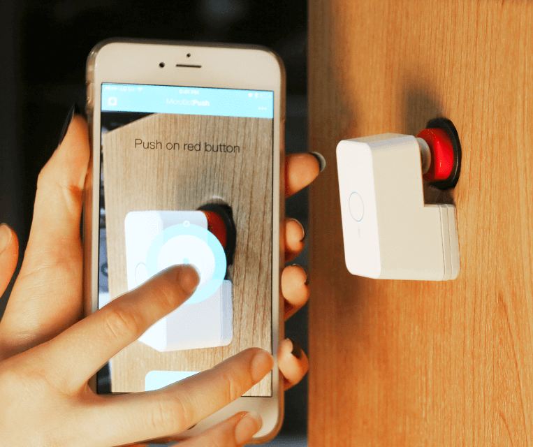
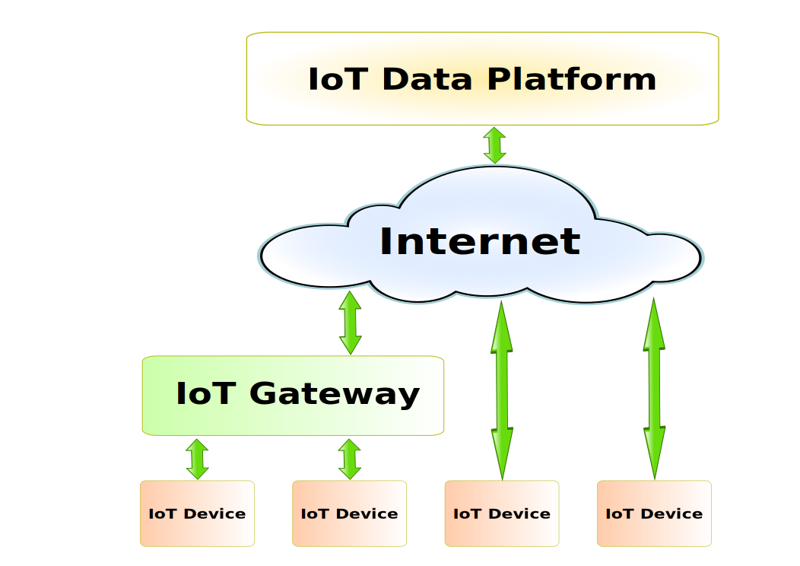
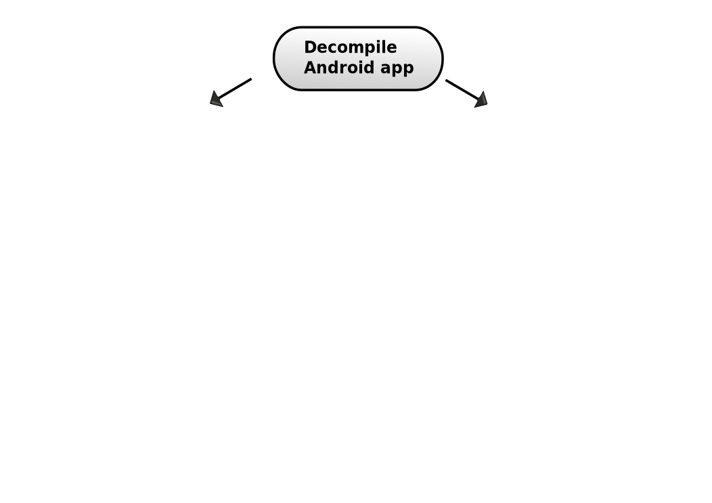
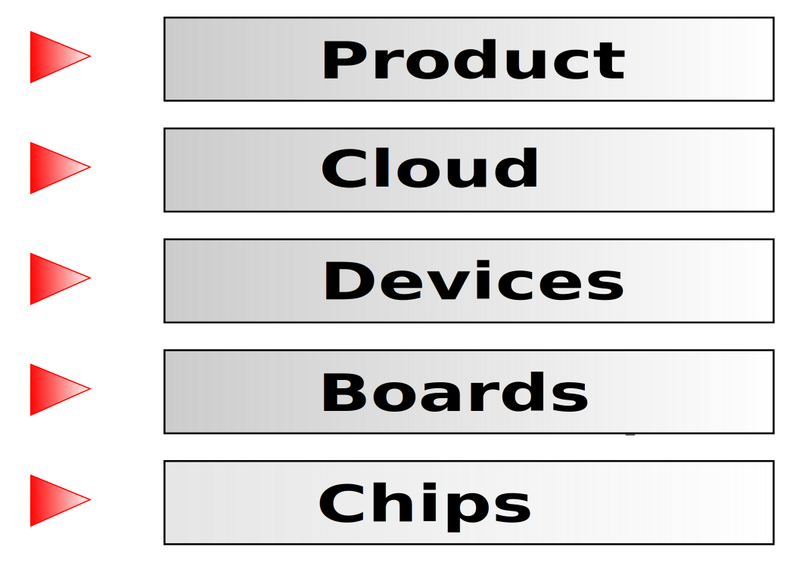
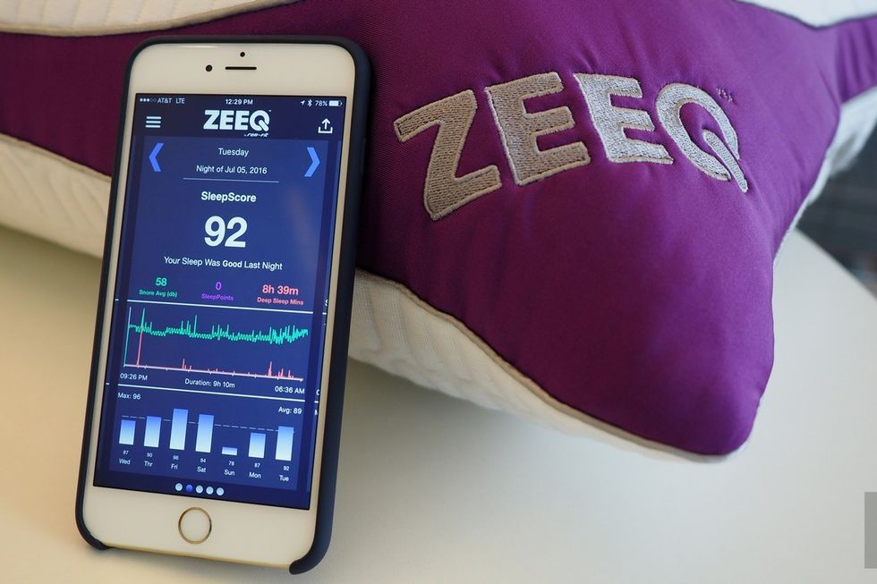
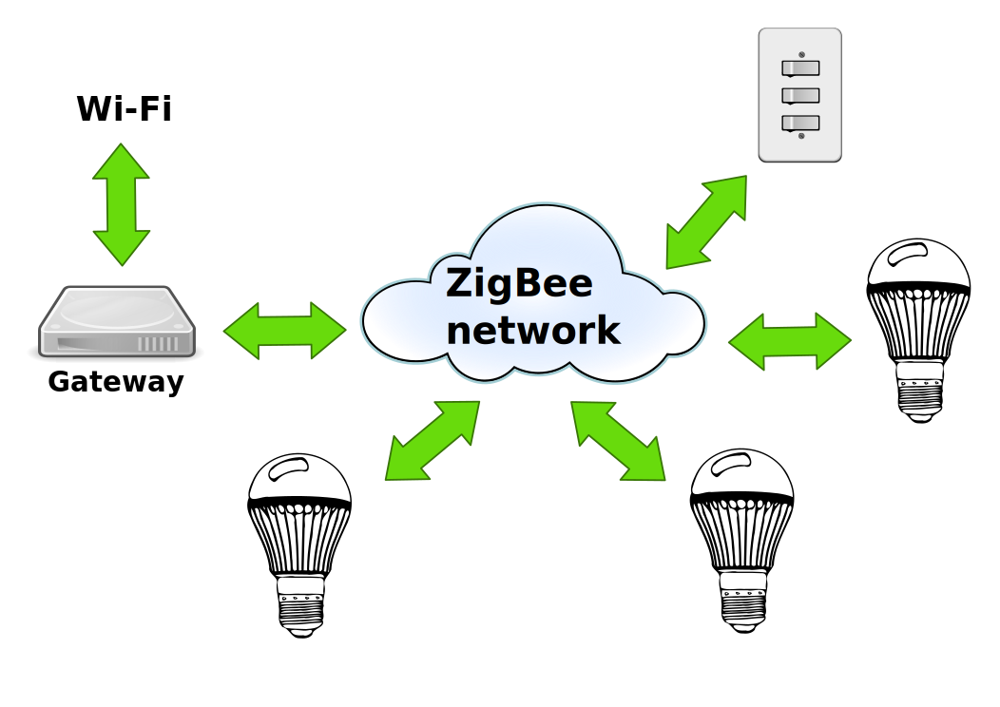

Horror stories of IoT security
==============================

*by Ilya Etingof, Red Hat Product Security*

The Things
==========

.. image:: iot-cloud.svg

The new dangers
===============

* Things are embedded into physical world
* We may not notice them
* But they are designed to watch us

Dreams come true
================

* Smart homes by Ray Bradbury in 1950
* Self-replicating robots by Karel Čapek in 1920

Things [we think] we buy
========================

* Smart homes: **Smart bulb**

.. figure:: smart-bulb.jpg
   :scale: 60 %
   :align: center

.. nextslide::

* Smart homes: **Smart thermostat**

.. figure:: nest-learning-thermostat.jpg
   :scale: 50 %
   :align: center

.. nextslide::

* Smart homes: **Smart pot**

.. figure:: smart-pot.jpg
   :scale: 70 %
   :align: center

.. nextslide::

* Smart homes: **Personal assistant**

.. figure:: amazon-echo.jpg
   :scale: 80 %
   :align: center

.. nextslide::

* Smart homes: **Dash button**

.. figure:: amazon-button.png
   :scale: 90 %
   :align: center

.. nextslide::

* **Flying robots**

.. figure:: amazon-delivery-drone.jpg
   :scale: 15 %
   :align: center

.. nextslide::

* **Medical things**

  * Drug infusion pumps
  * Pacemakers

.. nextslide::

* **Weird things**

  * **Smart brush**

.. figure:: smart-brush.jpg
   :scale: 100 %
   :align: center

.. nextslide::

* **Weird things**

  * **Smart mattress**

.. figure:: smart-mattress.png
   :scale: 70 %
   :align: center

.. nextslide::

* **Weird things**

  * **Doggy phone**

.. figure:: doggy-phone.jpg
   :scale: 90 %
   :align: center

.. nextslide::

* **Weird things**

  * **Button pusher**

.. nextslide::

* **Creepy things**

  * **Kissenger**

.. figure:: kissenger.jpg
   :scale: 70 %
   :align: center

.. nextslide::

* **Creepy things**

  * **Would you marry a robot?**

.. figure:: love-and-sex-with-robots-book.jpg
   :scale: 80 %
   :align: center

Things we buy
=============

.. figure:: internet-of-things.svg
   :scale: 80 %
   :align: center

The story of Hajime
===================

Hajime lives in here:

.. figure:: dahua-ip-camera.png
   :scale: 99 %
   :align: center

.. nextslide::

* Security analysis by Sam Edwards and Ioannis Profetis

IoT botnet attack
=================

.. figure:: botnet-network.svg
   :scale: 90 %
   :align: center

Image by `JeroenT96 <https://commons.wikimedia.org/w/index.php?curid=47443899>`_

.. nextslide::

.. figure:: hajime-attack-diagram-1.svg
   :align: center

.. nextslide::

.. figure:: hajime-attack-diagram-2.svg
   :align: center

.. nextslide::

.. figure:: hajime-attack-diagram-3.svg
   :align: center

.. nextslide::

* Upload phase one loader

.. code-block:: bash

   $ echo "\x7f\x45\x4c\x46\x0" >> /var/tmp/.loader
   ...
   $ exec /var/tmp/.loader

.. nextslide::

.. figure:: hajime-attack-diagram-4.svg
   :align: center

.. nextslide::

.. figure:: hajime-attack-diagram-5.svg
   :align: center

.. nextslide::

.. figure:: hajime-attack-diagram-6.svg
   :align: center

.. nextslide::

.. figure:: hajime-attack-diagram-7.svg
   :align: center

.. nextslide::

.. figure:: mirai-botnet-attack.gif
   :scale: 80 %
   :align: center

Image by `Joey Devilla <http://www.globalnerdy.com/2016/10/25/last-fridays-iot-botnet-attack-and-internet-outages-explained-for-non-techies/>`_

.. nextslide::

* **Flood of**

  * *HTTP requests*
  * *TCP SYN/ACK packets*
  * *DNS, UDP packets*

.. nextslide::

* **Scale of Mirai attack**

  * 100,000..500,000 bots
  * Terabits of traffic

Attack post-mortem
==================

* Default credentials
* Running telnetd

Fun fact
========

* `Linux.Wifatch`  -- a good worm

Inside IoT
==========

* Mirai attacked a Linux box...

.. nextslide::

* **Sensors / actuators**

.. figure:: iot-sensors.png
   :scale: 90 %
   :align: center

.. nextslide::

* Sensors / actuators
* **Embedded systems**

  * **Microcontrollers**

.. figure:: arduino-uno-pcb.jpg
   :scale: 40 %
   :align: center

.. nextslide::

* Sensors / actuators
* Embedded systems
* **IoT Gateways**

.. figure:: dell-edge-gateway-5000.png
   :scale: 50 %
   :align: center

.. nextslide::

* Sensors / actuators
* Embedded systems
* IoT Gateways
* **IoT Data platform**

  * *AWS IOT*
  * *Google Cloud IOT*
  * *Microsoft Azure IoT Suite*
  * *...*

.. nextslide::

The story of a plug
===================

.. figure:: kankun-smart-plug.jpg
   :scale: 30 %
   :align: center

*Security research by Matthew Garrett and others*

Plug under attack
=================

.. nextslide::

.. figure:: smart-plug-attack-diagram-2.svg
   :scale: 150 %
   :align: center

.. nextslide::

* Command protocol:

.. code-block:: bash

    lan_phone%MAC%PASSWORD%open%request
    lan_device%MAC%PASSWORD%confirm#CHALLENGE%rack
    lan_phone%MAC%PASSWORD%confirm#CHALLENGE%request
    lan_device%MAC%PASSWORD%open%rack

.. nextslide::

.. figure:: smart-plug-attack-diagram-3.svg
   :scale: 120 %
   :align: center

.. nextslide::

* Crypto key candidates

.. code-block:: bash

    $ strings libNDK_03.so
    ...
    UUPx((
    Zw–
    fdsl;mewrjope456fds4fbvfnjwaugfo
    java/lang/String
    ...

.. nextslide::

.. figure:: smart-plug-attack-diagram-4.svg
   :scale: 120 %
   :align: center

.. nextslide::

.. figure:: smart-plug-attack-diagram-5.svg
   :scale: 120 %
   :align: center

.. nextslide::

.. figure:: smart-plug-attack-diagram-6.svg
   :scale: 120 %
   :align: center

.. nextslide::

.. figure:: smart-plug-attack-diagram-7.svg
   :scale: 120 %
   :align: center

.. nextslide::

.. figure:: smart-plug-attack-diagram-8.svg
   :scale: 120 %
   :align: center

.. nextslide::

.. figure:: smart-plug-attack-diagram-9.svg
   :scale: 120 %
   :align: center

Exploit potential
=================

* DDoS targets on Internet
* Attack targets on Wi-Fi network
* Distributed spam
* Disrupt/destroy appliances

Attack post-mortem
==================

* Hardcoded key
* Plugs enumeration flaw
* Default password

IoT supply chain
================

Things are...
=============

* **Like hot cakes**

.. figure:: smart-fork.jpg
   :scale: 110 %
   :align: center

.. nextslide::

* Hot
* **Cool gadgets**

.. figure:: egg-counter.jpg
   :scale: 90 %
   :align: center

.. nextslide::

* Hot, cool
* **Easy to do (as it looks)**

.. nextslide::

* Hot, cool, easy
* **Hard to do right**

.. nextslide::

* Hot, cool, easy, hard
* **Too weak to defend**

.. nextslide::

* Hot, cool, easy, hard, weak
* **Powerful together**

.. nextslide::

* Hot, cool, easy, hard, weak, powerful
* **Messy inside**

.. figure:: spaghetti-monster.jpg
   :scale: 120 %
   :align: center

.. nextslide::

* Hot, cool, easy, hard, weak, powerful, messy
* **Misunderstood by everyone**

The story of smart lights
=========================

* **Philips Hue LED bulbs**

.. figure:: philips-hue-bulbs.png
   :scale: 70 %
   :align: center

*Researched by Eyal Ronen, Colin O’Flynn, Adi Shamir and Achi-Or Weingarten (http://iotworm.eyalro.net/)*

The lighting system
===================

ZigBee vulnerability
====================

.. figure:: zigbee-key-leak.png
   :scale: 120 %
   :align: center

Taking over bulbs
=================

.. figure:: philips-hue-attack-diagram-1.svg
   :align: center

.. nextslide::

.. figure:: zigbee-takeover-attack-1.svg
   :align: center

.. nextslide::

.. figure:: zigbee-takeover-attack-2.svg
   :align: center

.. nextslide::

.. figure:: zigbee-takeover-attack-3.svg
   :align: center

.. nextslide::

.. figure:: zigbee-takeover-attack-4.svg
   :align: center

.. nextslide::

.. figure:: philips-hue-attack-diagram-2.svg
   :align: center

Firmware compromise
===================

.. figure:: philips-hue-attack-diagram-3.svg
   :align: center

.. nextslide::

.. figure:: philips-hue-attack-diagram-4.svg
   :align: center

Unleashing the worm
===================

.. figure:: philips-hue-attack-diagram-5.svg
   :align: center

.. nextslide::

.. figure:: philips-hue-drone-attack.jpg
   :scale: 120 %
   :align: center

Attack post-mortem
==================

* Questionable ZigBee security

Major attack vectors
====================

  * Hardcoded passwords / keys
  * Forgotten services / vendor backdoors
  * Unsecured hardware interfaces
  * Web vulnerabilities

Future IoT
==========

* Things to become smarter

  * Learn and behave autonomously
  * Join brains

Advice for developers
=====================

* Realize that you are not alone!
* Avoid taking personal data
* If you do, encrypt everything
* Exercise secure development (https://builditsecure.ly)
* Hackers on demand (http://bugcrowd.com)

Advice for users
================

* Do not own IoT!
* Research before you buy
* Use dedicated network, firewall and disable uPnP
* Be cautious when buying/selling used devices

Summary
=======

* Things nearby might be watching you
* Treat Things as insecure by default
* Be reluctant giving them your data
* Repel Things from your home

Thank you!
==========
