Horror stories of IoT security
==============================

*by Ilya Etingof, Red Hat Product Security*

Agenda
======

* **Look at IoT technology**

.. nextslide::

* Look at IoT technology
* **Through the eyes of security researcher**

.. nextslide::

* Look at IoT technology
* Through the eyes of security researcher
* **To understand the risks and take action**

The Things
==========

* **Small, inexpensive computers**

.. nextslide::

* Small, inexpensive computers
* **With sensors/actuators**

.. nextslide::

* Small, inexpensive computers
* With sensors/actuators
* **Communicating over network**

.. nextslide::

.. image:: board-and-sensors.svg

The new dangers
===============

* **Not just data loss**

.. nextslide::

* Not just data loss
* **Things are embedded into physical world**

.. nextslide::

* Not just data loss
* Things are embedded into physical world
* **We may not notice them**

.. nextslide::

* Not just data loss
* Things are embedded into physical world
* We may not notice them
* **But they are designed to watch us**

.. nextslide::

* Not just data loss
* Things are embedded into physical world
* We may not notice them
* But they are designed to watch us
* **And they are massively insecure**

.. nextslide::

* Not just data loss
* Things are embedded into physical world
* We may not notice them
* But they are designed to watch us
* And they are massively insecure

  * *Let's see how...*

Dreams come true
================

* **Envisioned by Sci-Fi authors**

.. nextslide::

* Envisioned by Sci-Fi authors
* **Smart phones by Arthur C. Clarke in 1974**

.. nextslide::

* Envisioned by Sci-Fi authors
* Smart phones by Arthur C. Clarke in 1974
* **Smart homes by Ray Bradbury in 1950**

.. nextslide::

* Envisioned by Sci-Fi authors
* Smart phones by Arthur C. Clarke in 1974
* **Smart homes by Ray Bradbury in 1950**

  * *There Will Come Soft Rains*

.. nextslide::

* Envisioned by Sci-Fi authors
* Smart phones by Arthur C. Clarke in 1974
* Smart homes by Ray Bradbury in 1950
* **Self-replicating robots by Karel Čapek in 1920**

Things [we think] we buy
========================

* Smart homes: **Smart bulb**

.. figure:: smart-bulb.jpg
   :scale: 60 %
   :align: center

.. nextslide::

* Smart homes: **Smart thermostat**

.. figure:: nest-learning-thermostat.jpg
   :scale: 50 %
   :align: center

.. nextslide::

* Smart homes: **Smart pot**

.. figure:: smart-pot.jpg
   :scale: 70 %
   :align: center

.. nextslide::

* Smart homes: **Personal assistant**

.. figure:: amazon-echo.jpg
   :scale: 80 %
   :align: center

.. nextslide::

* Smart homes: **Dash button**

.. figure:: amazon-button.png
   :scale: 90 %
   :align: center

.. nextslide::

* **Flying robots**

.. figure:: amazon-delivery-drone.jpg
   :scale: 15 %
   :align: center

.. nextslide::

* **Medical things**

  * Insulin pumps
  * Pacemakers

.. nextslide::

* **Weird things**

  * **Smart brush**

.. figure:: smart-brush.jpg
   :scale: 100 %
   :align: center

.. nextslide::

* **Weird things**

  * **Smart mattress**

.. figure:: smart-mattress.png
   :scale: 70 %
   :align: center

.. nextslide::

* **Weird things**

  * **Doggy phone**

.. figure:: doggy-phone.jpg
   :scale: 90 %
   :align: center

.. nextslide::

* **Creepy things**

  * **Kissenger**

.. figure:: kissenger.jpg
   :scale: 70 %
   :align: center

.. nextslide::

* **Creepy things**

  * **Would you marry a robot?**

.. figure:: love-and-sex-with-robots-book.jpg
   :scale: 80 %
   :align: center

Things we buy
=============

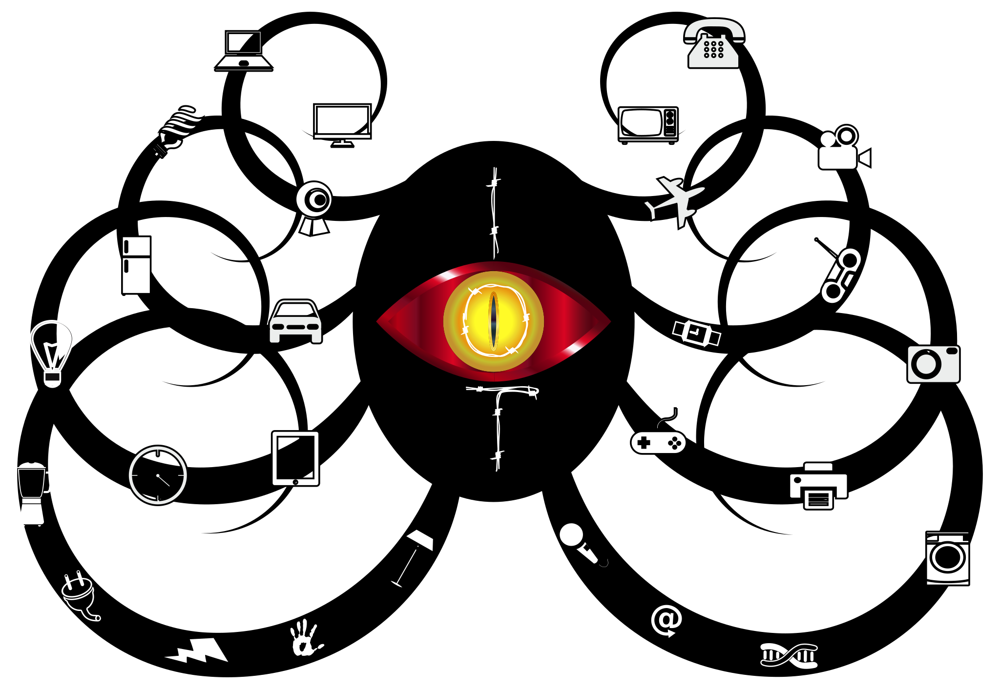

The story of Hajime
===================

Hajime lives in here:

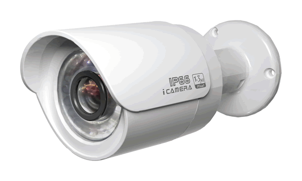

.. nextslide::

* On 21.10.2016 Amazon, Twitter, PayPal went down...
* Hajime: Mirai successor
* Analysed by Sam Edwards and Ioannis Profetis

IoT botnet attack
=================

* **Implant malicious software into many Things**

.. nextslide::

* Implant malicious software into many Things
* **To carry out distributed attacks**

.. nextslide::

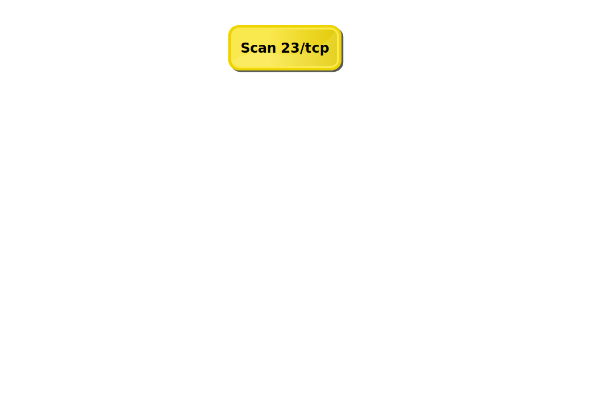

.. nextslide::

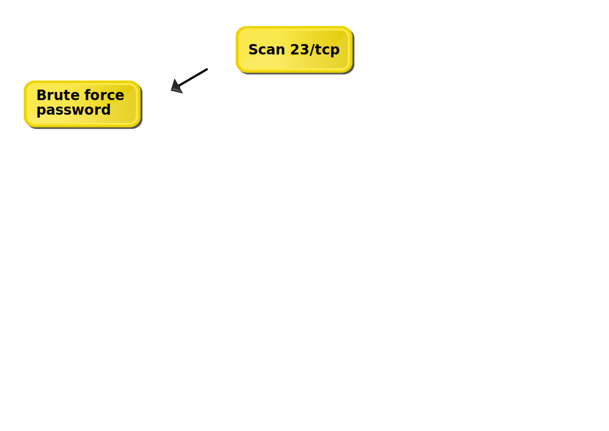

.. nextslide::

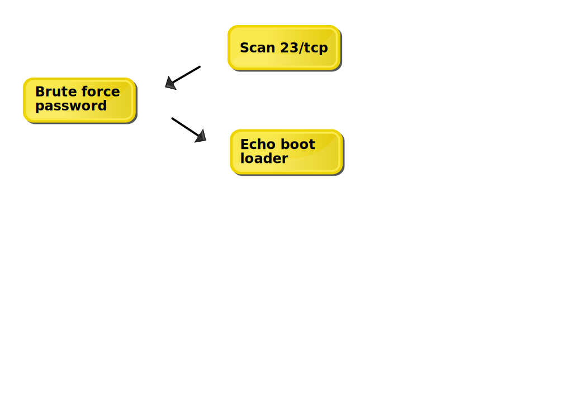

.. nextslide::

* Upload phase one loader

.. code-block:: bash

   $ echo "\x7f\x45\x4c\x46\x0" >> /var/tmp/.loader
   ...
   $ exec /var/tmp/.loader

.. nextslide::

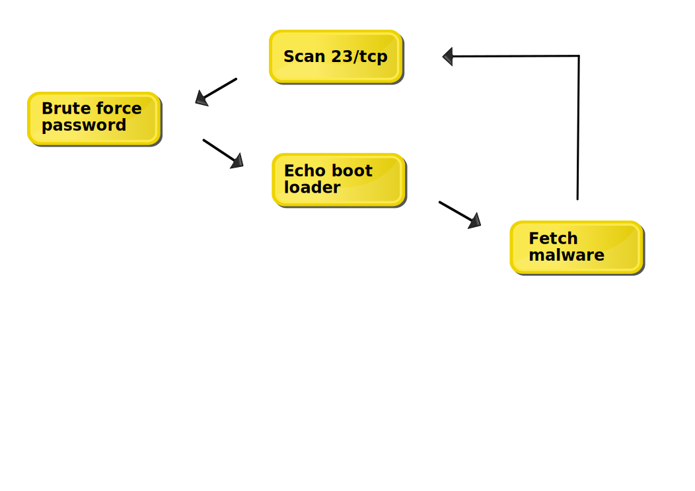

.. nextslide::

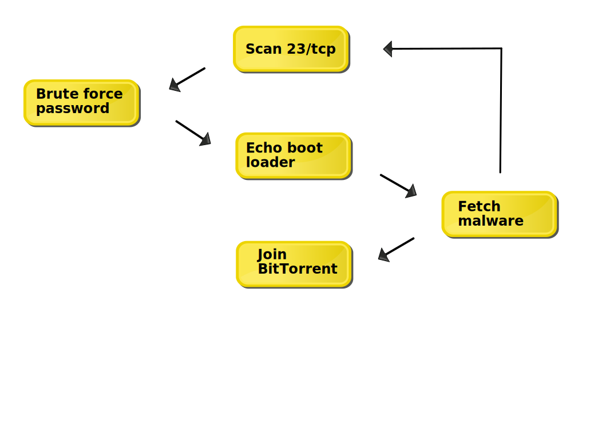

.. nextslide::

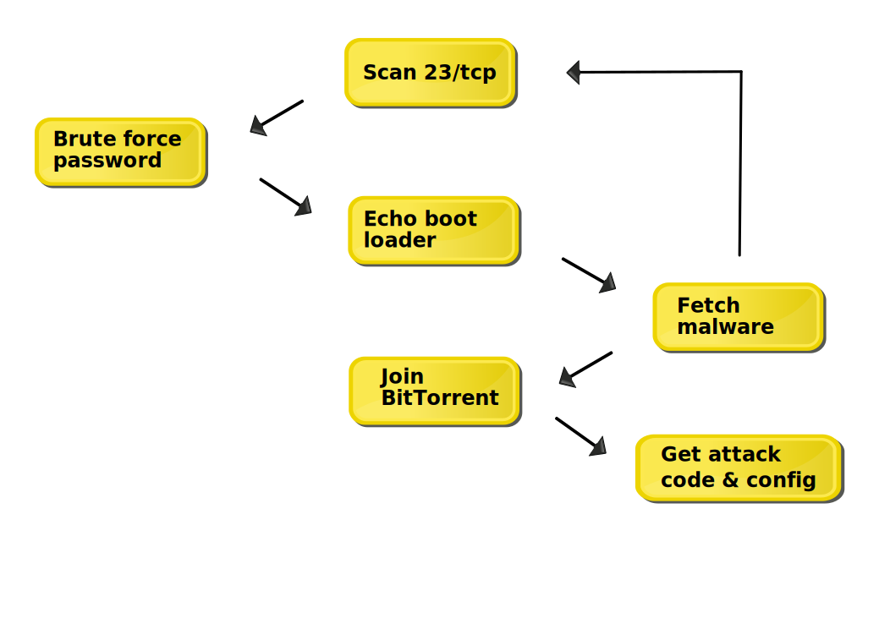

.. nextslide::

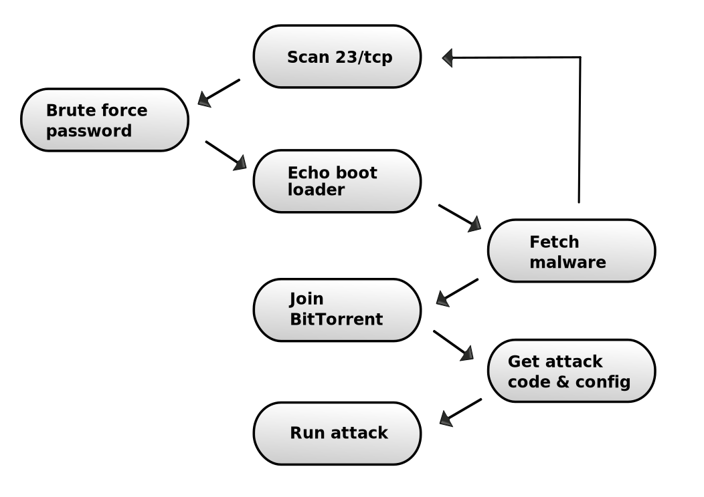

.. nextslide::

* Live botnet

.. figure:: botnet-architecture.gif
   :scale: 90 %
   :align: center

Image by `JeroenT96 <https://commons.wikimedia.org/w/index.php?curid=47443899>`_

.. nextslide::

* **Flood of**

  * *HTTP requests*
  * *TCP SYN/ACK packets*
  * *DNS, UDP packets*

.. nextslide::

.. figure:: mirai-botnet-attack.gif
   :scale: 80 %
   :align: center

Image by `Joey Devilla <http://www.globalnerdy.com/2016/10/25/last-fridays-iot-botnet-attack-and-internet-outages-explained-for-non-techies/>`_

Attack post-mortem
==================

* Manufacturer's failure
* Upcoming attacks against 80/tcp

Fun fact
========

* `Linux.Wifatch` malware

.. nextslide::

* `Linux.Wifatch`:

  * *Shutdown telnet service*
  * *Change default password*

What's inside an IoT system?
============================

* This was an attack against a Linux box
* Let's take closer look at IoT

.. nextslide::

* **No rigid architecture**

.. nextslide::

* **Sensors / actuators**

.. figure:: iot-sensors.png
   :scale: 90 %
   :align: center

.. nextslide::

* Sensors / actuators
* **Embedded system**

  * **Single-board computers**

    * *Raspberry Pi*
    * *Beagle Board*
    * *Electric Imp*
    * *Gumstix*

.. nextslide::

* Sensors / actuators
* **Embedded systems**

  * **Single-board computers**

.. figure:: raspberry-pi-pcb.jpg
   :scale: 70 %
   :align: center

.. nextslide::

* Sensors / actuators
* **Embedded systems**

  * **Microcontrollers**
   * *Arduino*
   * *Pinoccio*
   * *CubieBoard*
   * ...

.. nextslide::

* Sensors / actuators
* **Embedded systems**

.. figure:: arduino-uno-pcb.jpg
   :scale: 50 %
   :align: center

.. nextslide::

* Sensors / actuators
* Embedded systems
* **Gateways**

.. figure:: dell-edge-gateway-5000.png
   :scale: 50 %
   :align: center

.. nextslide::

* Sensors / actuators
* Embedded systems
* Gateways
* **Data platform**

.. nextslide::

* Sensors / actuators
* Embedded systems
* Gateways
* **Data platform**

  * **Cloud Service Providers**

.. nextslide::

* Sensors / actuators
* Embedded systems
* Gateways
* **Data platform**

  * **Cloud Service Providers**

      * *AWS IOT*
      * *Google Cloud IOT*
      * *Microsoft Azure IoT Suite*
      * *...*

.. nextslide::

* Let's look at another attack
* That involves the cloud

The story of a plug
===================

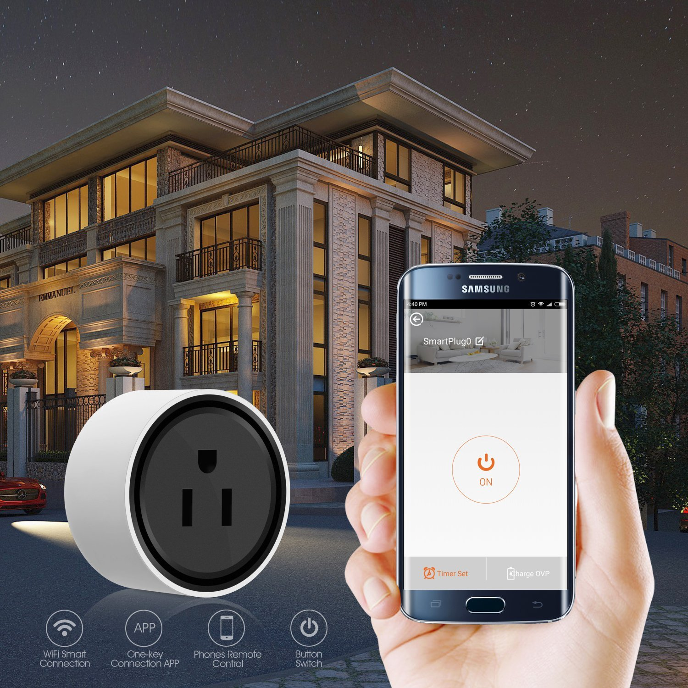

*Security research by Matthew Garrett and others*

.. nextslide::

* **Just a wall socket**

.. nextslide::

* Just a wall socket
* **You can turn power on/off from a smartphone**

.. nextslide::

* Just a wall socket
* You can turn power on/off from a smartphone
* **May be not only you...? ;-)**

Plug under attack
=================

.. figure:: smart-plug-attack-diagram-2.svg
   :scale: 150 %
   :align: center

.. nextslide::

* Command protocol:

.. code-block:: bash

    lan_phone%MAC%PASSWORD%open%request
    lan_device%MAC%PASSWORD%confirm#CHALLENGE%rack
    lan_phone%MAC%PASSWORD%confirm#CHALLENGE%request
    lan_device%MAC%PASSWORD%open%rack

.. nextslide::

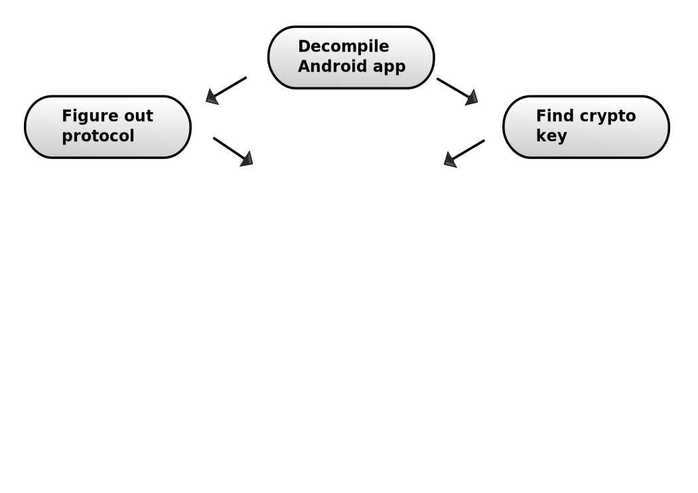

.. nextslide::

* Crypto key candidates

.. code-block:: bash

    $ strings libNDK_03.so
    ...
    UUPx((
    Zw–
    fdsl;mewrjope456fds4fbvfnjwaugfo
    java/lang/String
    ...

.. nextslide::

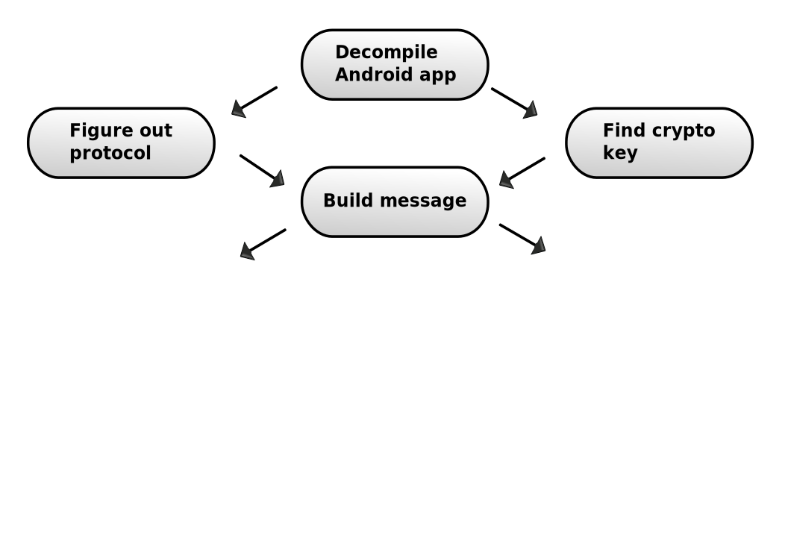

.. nextslide::

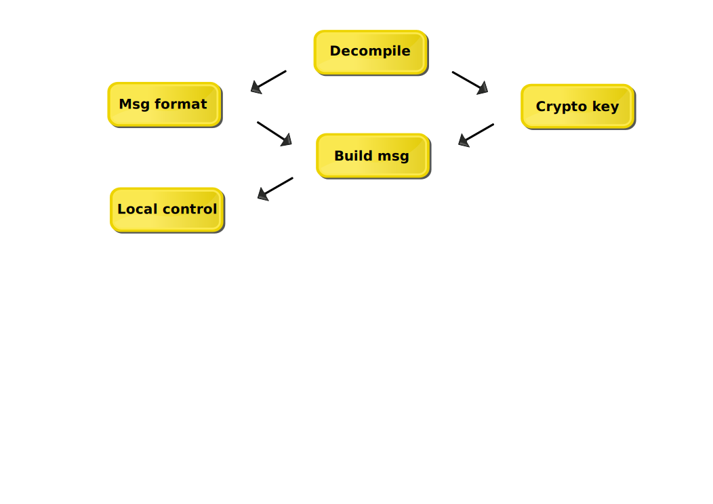

.. nextslide::

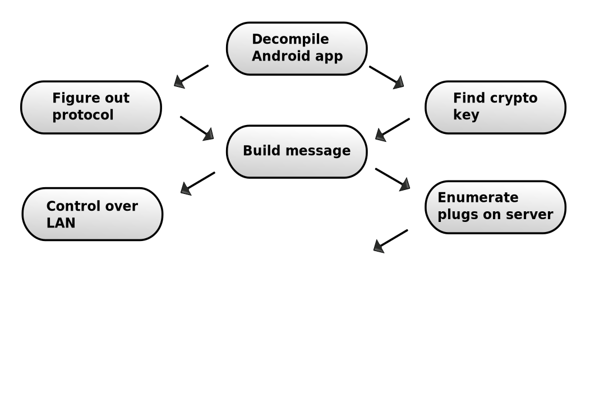

.. nextslide::

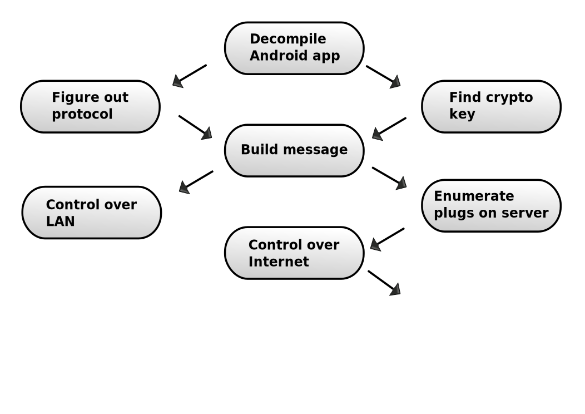

.. nextslide::

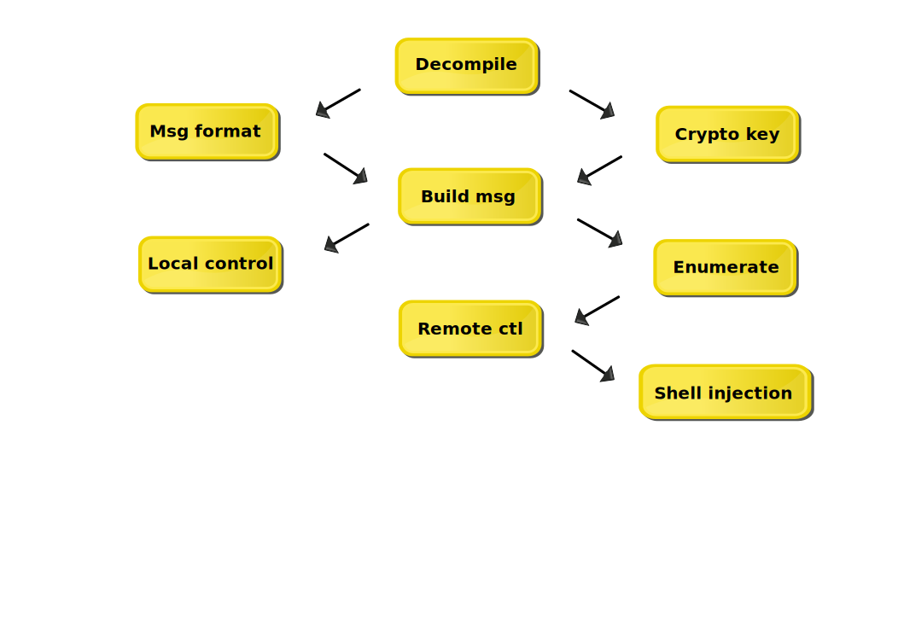

.. nextslide::

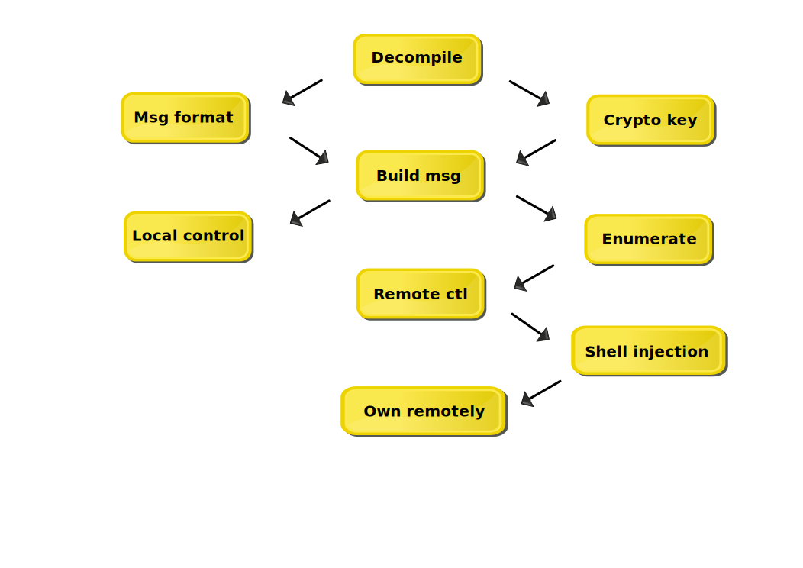

Exploit potential
=================

* DDoS targets on Internet
* Attack targets on Wi-Fi network
* Distributed spam
* Disrupt/destroy appliances by flipping power on/off

Attack post-mortem
==================

* Hardcoded key
* Plugs enumeration flaw
* Default password

Who cares about security?
=========================

* Let's see who is building the Things and how...

IoT supply chain
================

* **IoT is a sophisticated high-tech**

.. nextslide::

* IoT is a sophisticated high-tech
* **Duct-taped together**

.. nextslide::

* IoT is a sophisticated high-tech
* Duct-taped together
* **ASAP**

.. nextslide::

* IoT is a sophisticated high-tech
* Duct-taped together
* ASAP
* **Fertile soil for bug breeding...**

.. nextslide::

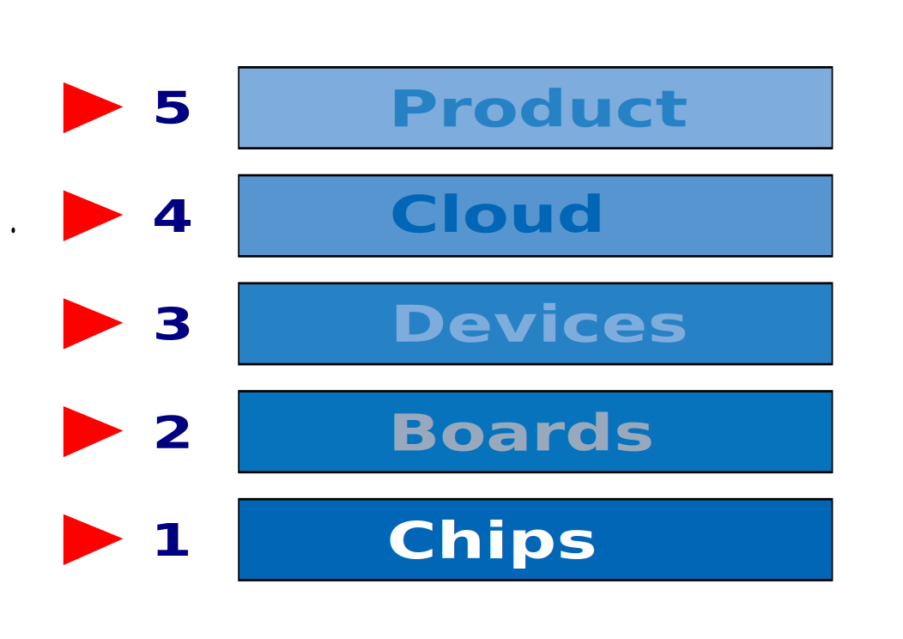

Who builds Things
=================

* **Original Design manufacturers**

  * **Design and manufacture the product**

.. nextslide::

* **Original Design manufacturers**

  * Design and manufacture the product
  * **Many small companies from China**

.. nextslide::

* **Original Design manufacturers**

  * Design and manufacture the product
  * Many small companies from China
  * **Produce [insecure] software fast**

Who sells Things
================

* **Original Equipment Manufacturers**

  * **Security - just a checkbox**

.. nextslide::

* **Original Equipment Manufacturers**

  * Security - just a checkbox
  * **No code to work with**

.. nextslide::

* **Original Equipment Manufacturers**

  * Security - just a checkbox
  * No code to work with
  * **Forward disclosures to a vendor**

.. nextslide::

* **Original Equipment Manufacturers**

  * Security - just a checkbox
  * No code to work with
  * Forward disclosures to a vendor
  * **Or sue security researcher**

Factors of insecurity
=====================

Why many Things are insecure?

.. nextslide::

* **IoT is hot**

  * *Modern forks must have mobile apps!*

.. figure:: smart-fork.jpg
   :scale: 90 %
   :align: center

.. nextslide::

* **IoT is cool**

  * *"What a gadget! I must have it NOW!"*

.. figure:: egg-counter.jpg
   :scale: 80 %
   :align: center

.. nextslide::

* **IoT is paradoxical**

  * **We poke fun at smart devices...**

.. nextslide::

* **IoT is paradoxical**

  * We poke fun at smart devices...
  * **...and happily buy them**

.. nextslide::

* **IoT is easy**

  * **Adding a computer to a product is cheap...**

.. nextslide::

* **IoT is easy**

  * Adding a computer to a product is cheap...
  * **...up to the moment of attack**

.. nextslide::

* **IoT is messy**

  * **Layers of software**

.. figure:: spaghetti-monster.jpg
   :scale: 100 %
   :align: center

.. nextslide::

* **IoT is messy**

  * Layers of software
  * **From uncoordinated teams**

.. nextslide::

* **IoT is messy**

  * Layers of software
  * From uncoordinated teams
  * **Went through a long supply chain**

.. nextslide::

* **IoT is misunderstood**

  * **It is still a general purpose computer**

.. nextslide::

* **IoT is misunderstood**

  * It is still a general purpose computer
  * **Disguised as an appliance**

.. nextslide::

* **IoT is misunderstood**

  * It is still a general purpose computer
  * Disguised as an appliance
  * **Manufactured as an appliance, not software**

.. nextslide::

* **IoT is vulnerable**

  * **Physical access may be easy**

.. nextslide::

* **IoT is vulnerable**

  * Physical access may be easy
  * **No CPU power for strong crypto**

.. nextslide::

* **IoT is vulnerable**

  * Physical access may be easy
  * No CPU power for strong crypto
  * **A low-entropy system**

.. nextslide::

* **IoT is powerful**

  * **Billions of devices**

.. nextslide::

* **IoT is powerful**

  * Billions of devices
  * **Teraflops of processing power if harnessed**

.. nextslide::

* **Mitigation is hard**

  * **Owners misunderstand risks and do not care**

.. nextslide::

* **Mitigation is hard**

  * Owners misunderstand risks and do not care
  * **Hard for vendors to ship patches**

.. nextslide::

* **Mitigation is hard**

  * Owners misunderstand risks and do not care
  * Hard for vendors to ship patches
  * **Hard to regain control over taken over device**

.. nextslide::

* **Mitigation is hard**

  * Owners misunderstand risks and do not care
  * Hard for vendors to ship patches
  * Hard to regain control over taken over system
  * **Hard to get infected devices off the network**

.. nextslide::

* **Mitigation is hard**

  * Owners misunderstand risks and do not care
  * Hard for vendors to ship patches
  * Hard to regain control over taken over system
  * **Hard to get infected devices off the network**

    * *http://www.shodan.io*

Who cares about security?
=========================

Let's look at a premium gadget...

The story of smart lights
=========================

* **Philips Hue LED bulbs**

.. figure:: philips-hue-bulbs.png
   :scale: 70 %
   :align: center

*Researched by Eyal Ronen, Colin O’Flynn, Adi Shamir and Achi-Or Weingarten (http://iotworm.eyalro.net/)*

.. nextslide::

* Philips Hue LED bulbs
* **Most popular smart light**

.. nextslide::

* Philips Hue LED bulbs
* Most popular smart light
* **Millions sold**

Features
========

* **Can turn on/off, change luminosity, color**

.. nextslide::

* Can turn on/off, change luminosity, color
* **Through local switches, smartphone app over Internet**

Inside the bulb
===============

* Atmel SoC

  * *Microprocessor, RAM, flash*
  * *Hardware AES accelerator*
  * *Zigbee network*

The lighting system
===================

* **Bulbs, switches, gateway in ZigBee network**

.. nextslide::

* Bulbs, switches, gateway in ZigBee network
* **Gateway**

  * *Also in Wi-Fi network*
  * *Supports REST API for each bulb*
  * *Connects to cloud*

ZigBee network attack
=====================

.. nextslide::

.. nextslide::

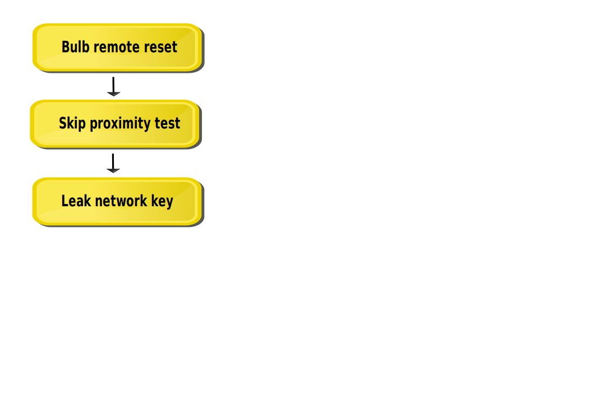

.. nextslide::

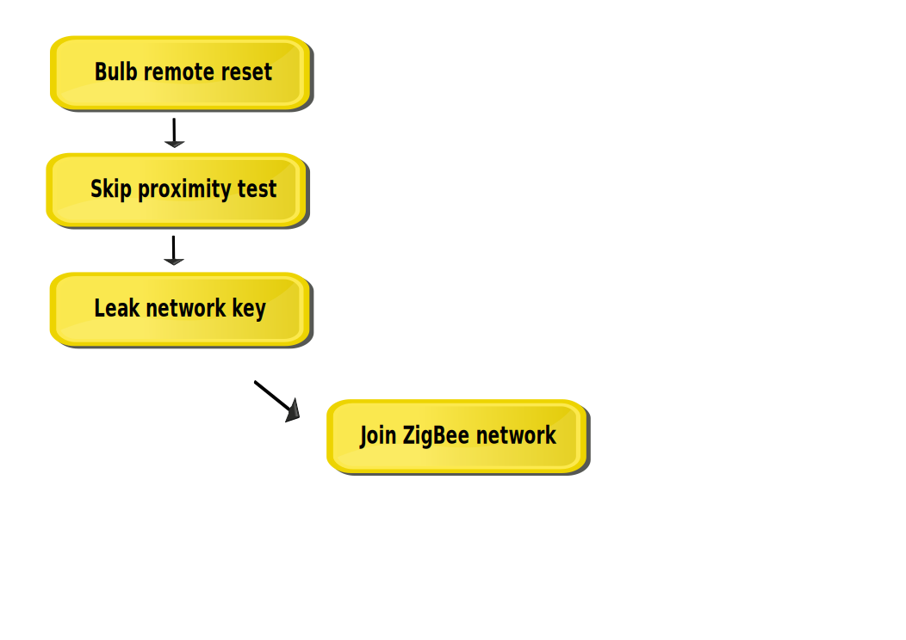

Firmware compromise
===================

.. figure:: philips-hue-attack-diagram-5.svg
   :align: center

.. nextslide::

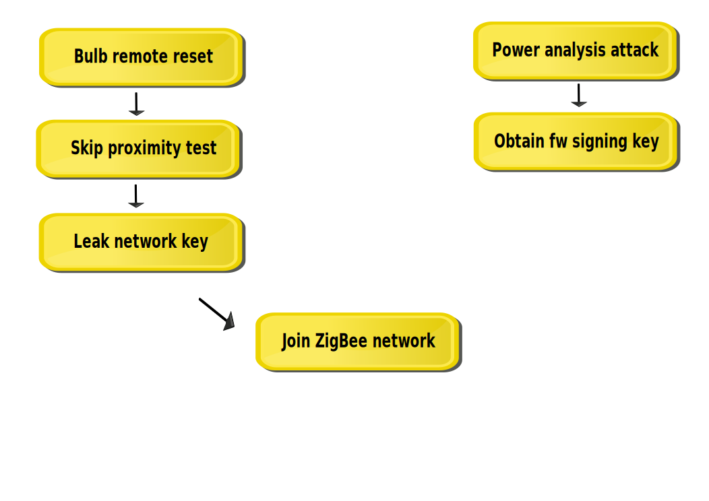

.. nextslide::

.. figure:: philips-hue-attack-diagram-7.svg
   :align: center

Unleashing worm
===============

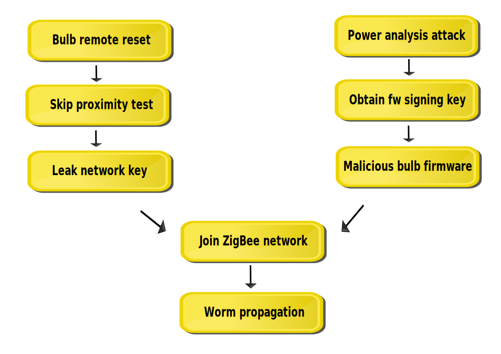

Exploit potential
=================

* **Taking over or bricking bulbs**

.. nextslide::

* Taking over or bricking bulbs
* **2.4GHz network jamming**

.. nextslide::

* Taking over or bricking bulbs
* 2.4GHz network jamming
* **Worm propagation is hard to stop**

Who cares about security?
=========================

* Hardcoded encryption key
* Security through obscurity never works

Major attack vectors
====================

How do they attack Things...

.. nextslide::

* **Device**

  * **Hardcoded passwords / API keys**

.. nextslide::

* **Device**

  * Hardcoded passwords / API keys
  * **Forgotten services / vendor backdoors**

.. nextslide::

* **Device**

  * Hardcoded passwords / API keys
  * Forgotten services / vendor backdoors
  * **Unsecured hardware interfaces**

.. nextslide::

* **Device**

  * Hardcoded passwords / API keys
  * Forgotten services / vendor backdoors
  * **Unsecured hardware interfaces**

    * *UART, SPI, I2O, JTAG*

.. nextslide::

* **Device**

  * Hardcoded passwords / API keys
  * Forgotten services / vendor backdoors
  * Unsecured hardware interfaces
  * **Code injection vulnerabilities**

.. nextslide::

* Device
* **Platform**

  **Good old Web vulns**

    * *CSRF, XSS, SQL injection*
    * *SSL misconfiguration*

Future IoT
==========

* **Things to become smarter**

  * **Learn and behave intelligently**

.. nextslide::

* **Things to become smarter**

  * Learn and behave intelligently
  * **Join brains**

Advice for users
================

* Do not own IoT!
* Research before you buy (track record, data privacy policy)
* Use dedicated network, firewall and disable uPnP
* Be cautious when selling used IoT

Advice for developers
=====================

* Realize that you are not alone!
* Avoid taking personal data
* If you do, encrypt everything
* Exercise secure development (https://builditsecure.ly)
* Employ hackers on demand (http://bugcrowd.com)
