Horror stories of IoT security
==============================

*by Ilya Etingof, Red Hat Product Security*

Agenda
======

* **Look at IoT**

.. nextslide::

* Look at IoT
* **Through the eyes of a hacker**

.. nextslide::

* Look at IoT
* Through the eyes of a hacker
* **To mitigate before it's too late**

The Things
==========

* **Small, inexpensive computers**

.. nextslide::

* Small, inexpensive computers
* **With sensors/actuators**

.. nextslide::

* Small, inexpensive computers
* With sensors/actuators
* **Communicating over network**

The new dangers
===============

* **Not just data loss**

.. nextslide::

* Not just data loss
* **Things are embedded into physical world**

.. nextslide::

* Not just data loss
* Things are embedded into physical world
* **We may not notice them**

.. nextslide::

* Not just data loss
* Things are embedded into physical world
* We may not notice them
* **But they are designed to watch us**

.. nextslide::

* Not just data loss
* Things are embedded into physical world
* We may not notice them
* But they are designed to watch us
* **And they are massively insecure**

.. nextslide::

* Not just data loss
* Things are embedded into physical world
* We may not notice them
* But they are designed to watch us
* And they are massively insecure

  * *Let's see why...*

Dreams come true
================

* **Envisioned by Sci-Fi authors**

.. nextslide::

* Envisioned by Sci-Fi authors
* **Smart phones by Arthur C. Clarke in 1974**

.. nextslide::

* Envisioned by Sci-Fi authors
* Smart phones by Arthur C. Clarke in 1974
* **Smart homes by Ray Bradbury in 1950**

.. nextslide::

* Envisioned by Sci-Fi authors
* Smart phones by Arthur C. Clarke in 1974
* **Smart homes by Ray Bradbury in 1950**

  * *There Will Come Soft Rains*

Today's Things
==============

* Compact, cheap electronics
* Batteries

.. nextslide::

* **RFID**

.. figure:: rfid.jpg
   :scale: 90 %
   :align: center

.. nextslide::

* **Wearable computers**

.. figure:: nike-fuel-band.jpg
   :scale: 50 %
   :align: center

.. nextslide::

* Smart homes: **Smart bulb**

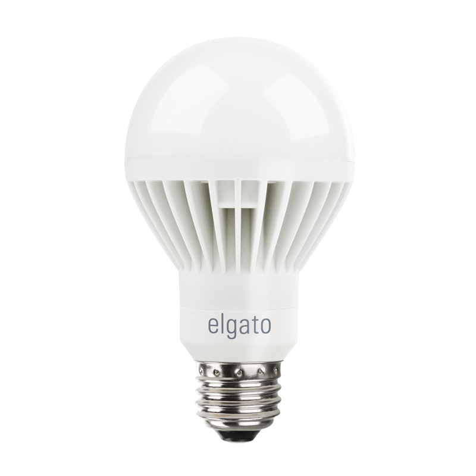

.. nextslide::

* Smart homes: **Smart thermostat**

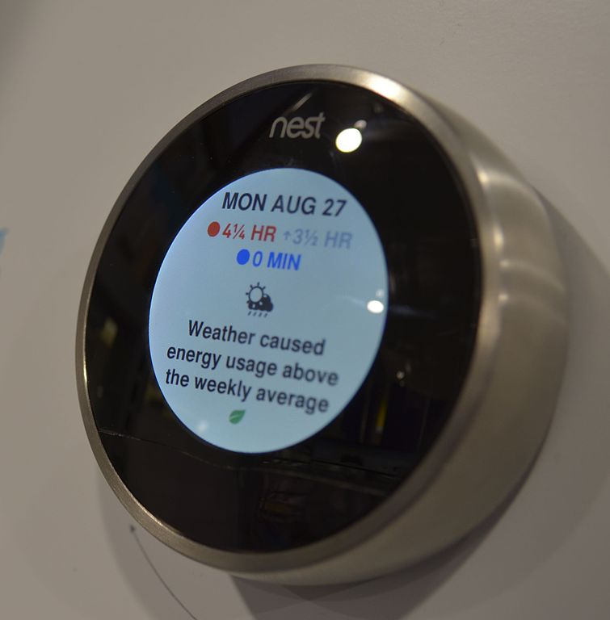

.. nextslide::

* Smart homes: **Smart pot**

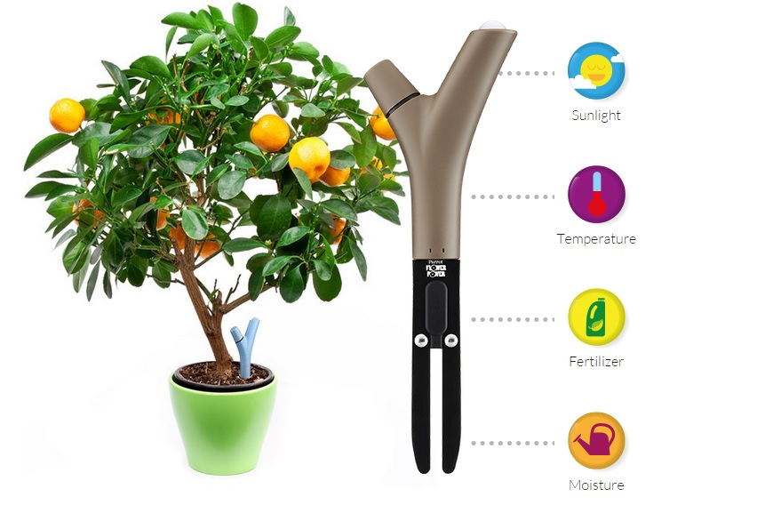

.. nextslide::

* Smart homes: **Personal assistant**

.. nextslide::

* Smart homes: **Dash button**

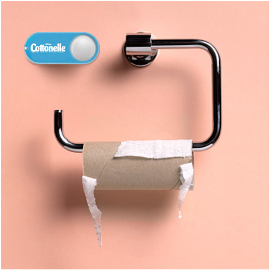

.. nextslide::

* **Flying robots**

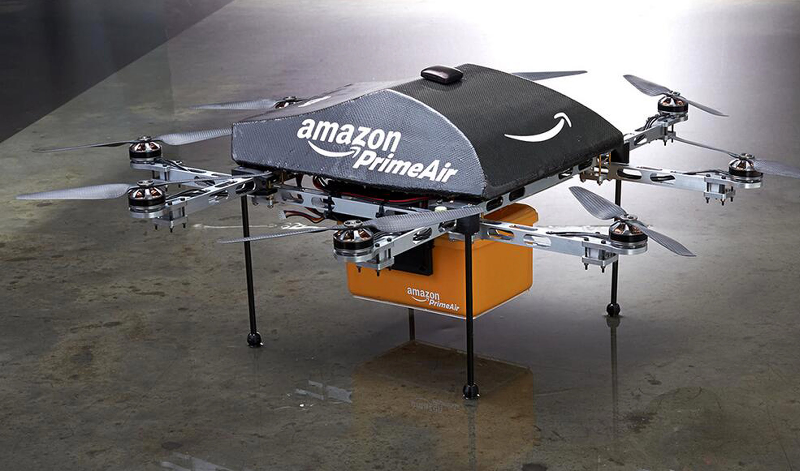

.. nextslide::

* **Flying robots**

  * **Autonomous navigation, obstacle avoidance**

.. figure:: drone-flying.jpg
   :scale: 70 %
   :align: center

.. nextslide::

* **Flying robots**

  * Autonomous navigation, obstacle avoidance
  * **Air traffic control**

.. nextslide::

* **Medical things**

  * Insulin pumps
  * Pacemakers

.. nextslide::

* **Weird things**

  * **Smart brush**

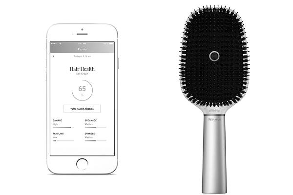

.. nextslide::

* **Weird things**

  * **Smart mattress**

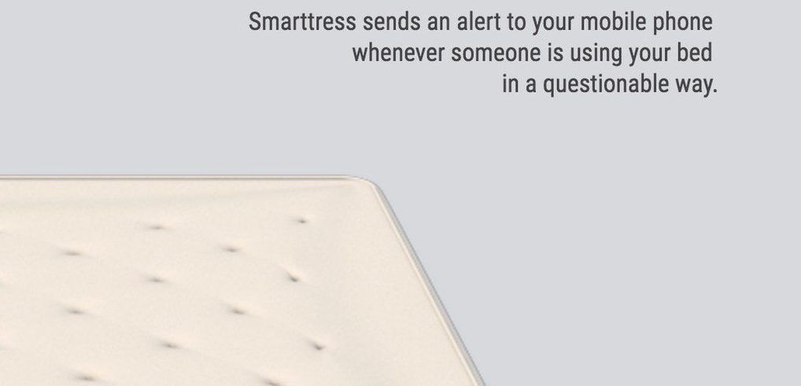

.. nextslide::

* **Weird things**

  * **Doggy phone**

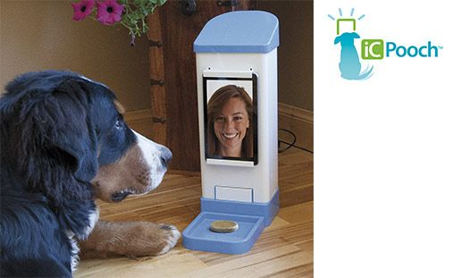

.. nextslide::

* **Creepy things**

  * **Kissenger**

.. nextslide::

* **Creepy things**

  * **Would you marry a robot?**

Future IoT
==========

* **Things to become smarter**

  * **Learn and behave intelligently**

.. nextslide::

* **Things to become smarter**

  * Learn and behave intelligently
  * **Join brains**

What's inside an IoT system?
============================

* **No rigid architecture**

.. nextslide::

* **Sensors / actuators**

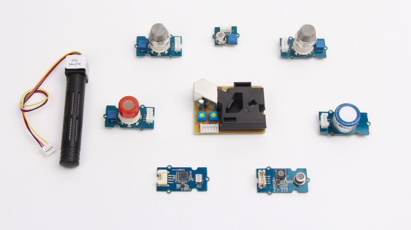

.. nextslide::

* Sensors / actuators
* **Embedded system**

  * **Single-board computers**

    * *Raspberry Pi*
    * *Beagle Board*
    * *Electric Imp*
    * *Gumstix*

.. nextslide::

* Sensors / actuators
* **Embedded systems**

  * **Single-board computers**

.. figure:: raspberry-pi-pcb.jpg
   :scale: 70 %
   :align: center

.. nextslide::

* Sensors / actuators
* **Embedded systems**

  * **Microcontrollers**
   * *Arduino*
   * *Pinoccio*
   * *CubieBoard*
   * ...

.. nextslide::

* Sensors / actuators
* **Embedded systems**

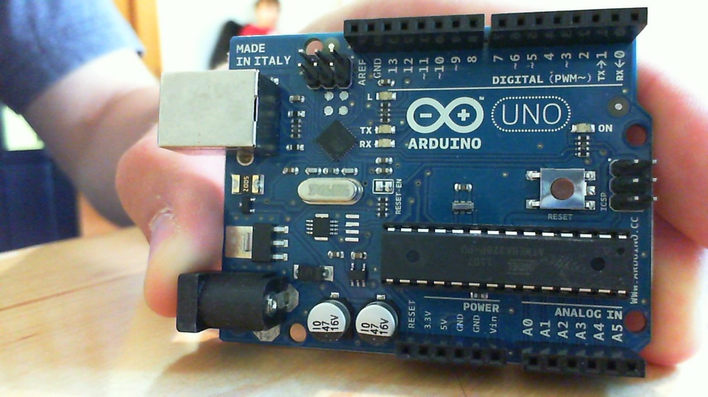

.. nextslide::

* Sensors / actuators
* Embedded systems
* **Gateways**

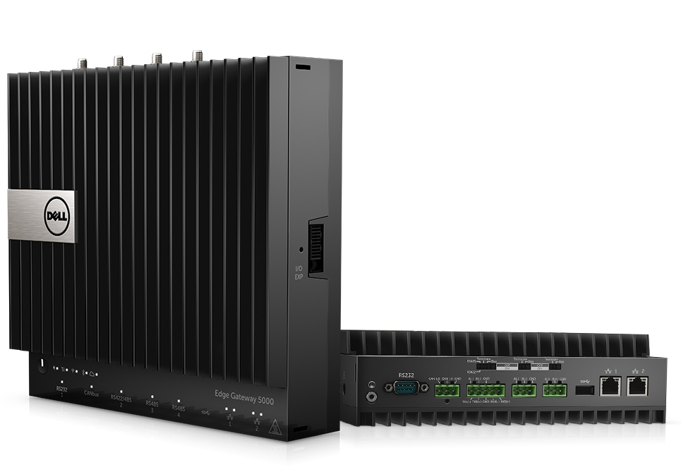

.. nextslide::

* Sensors / actuators
* Embedded systems
* Gateways
* **Data platform**

.. nextslide::

* Sensors / actuators
* Embedded systems
* Gateways
* **Data platform**

  * **Cloud Service Providers**

.. nextslide::

* Sensors / actuators
* Embedded systems
* Gateways
* **Data platform**

  * **Cloud Service Providers**

      * *AWS IOT*
      * *Google Cloud IOT*
      * *Microsoft Azure IoT Suite*
      * *...*

IoT supply chain
================

* **IoT is a sophisticated high-tech**

.. nextslide::

* IoT is a sophisticated high-tech
* **Duct-taped together**

.. nextslide::

* IoT is a sophisticated high-tech
* Duct-taped together
* **ASAP**

.. nextslide::

* IoT is a sophisticated high-tech
* Duct-taped together
* ASAP
* **Must be vulnerable!**

.. nextslide::

* Chips manufacturers
* Boards manufacturers
* Original Design manufacturers
* Cloud Service Providers
* Original Equipment Manufacturers

The weakest link
================

* **Original Design manufacturers**

  * **Design and manufacture the product**

.. nextslide::

* **Original Design manufacturers**

  * Design and manufacture the product
  * **Many small companies from China**

.. nextslide::

* **Original Design manufacturers**

  * Design and manufacture the product
  * Many small companies from China
  * **Produce [insecure] software fast**

Who cares about security
========================

* **OEMs may [not] do security**

  * **Just a checkbox**

.. nextslide::

* **OEMs may [not] do security**

  * Just a checkbox
  * **No code to work with**

.. nextslide::

* **OEMs may [not] do security**

  * Just a checkbox
  * No code to work with
  * **Forward disclosures to a vendor**

.. nextslide::

* **OEMs may [not] do security**

  * Just a checkbox
  * No code to work with
  * Forward disclosures to a vendor
  * **Or sue security researcher**

Factors of insecurity
=====================

* **IoT is hot**

  * *Modern forks must have mobile apps!*

.. nextslide::

* **IoT is cool**

  * *What a gadget! I must have it NOW!*

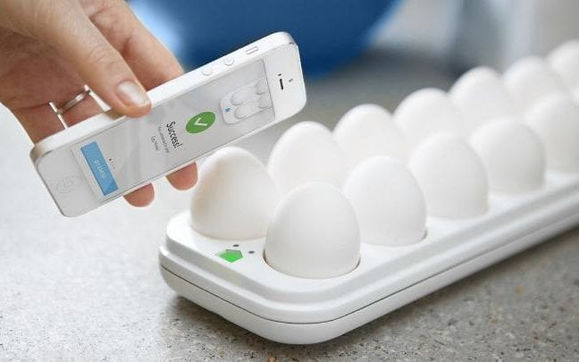

.. nextslide::

* **IoT is easy**

  * *Just add a $5 Arduino to a coffee maker*

.. nextslide::

* **IoT is easy**

  * Just add a $5 Arduino to a coffee maker
  * *...and we are in IoT business!*

.. nextslide::

* **IoT is easy**

  * Just add a $5 Arduino to a coffee maker
  * ...and we are in IoT business!
  * *Hmm, our coffee maker demands a ransom...*

.. nextslide::

* **IoT is easy**

  * Just add a $5 Arduino to a coffee maker
  * ...and we are in IoT business!
  * Hmm, our coffee maker demands a ransom...
  * *What does "security engineering" mean?*

.. nextslide::

* **IoT is messy**

  * **Layers of software**

.. figure:: spaghetti-monster.jpg
   :scale: 90 %
   :align: center

.. nextslide::

* **IoT is messy**

  * Layers of software
  * **From uncoordinated teams**

.. nextslide::

* **IoT is messy**

  * Layers of software
  * From uncoordinated teams
  * **Went through a long supply chain**

.. nextslide::

* IoT is hackable

  * **No CPU power for public key crypto**

.. nextslide::

* IoT is hackable

  * No CPU power for public key crypto
  * **Physical access may be easy**

.. nextslide::

* **Mitigation is hard**

  * **Owners miscalculate risks and do not care**

.. nextslide::

* **Mitigation is hard**

  * Owners miscalculate risks and do not care
  * **No software updates from vendor**

.. nextslide::

* **Mitigation is hard**

  * Owners miscalculate risks and do not care
  * No software updates from vendor
  * **No easy way to regain control over taken over device**

.. nextslide::

* **Mitigation is hard**

  * Owners miscalculate risks and do not care
  * No software updates from vendor
  * No easy way to regain control over taken over system
  * **Hard to get infected devices off the network**

.. nextslide::

* **Mitigation is hard**

  * Owners miscalculate risks and do not care
  * No software updates from vendor
  * No easy way to regain control over taken over system
  * **Hard to get infected devices off the network**

    * *http://www.shodan.io*

Major attack vectors
====================

* **Device**

  * **Hardcoded passwords / API keys**

.. nextslide::

* **Device**

  * Hardcoded passwords / API keys
  * **Forgotten services / vendor backdoors**

.. nextslide::

* **Device**

  * Hardcoded passwords / API keys
  * Forgotten services / vendor backdoors
  * **Unsecured hardware interfaces**

.. nextslide::

* **Device**

  * Hardcoded passwords / API keys
  * Forgotten services / vendor backdoors
  * Unsecured hardware interfaces
  * **Code injection vulnerabilities**

.. nextslide::

* **Device**

  * Hardcoded passwords / API keys
  * Forgotten services / backdoors
  * Unsecured hardware interfaces
  * Code injection vulnerabilities
  * **Wireless networks vulnerabilities**

.. nextslide::

* Device
* **Platform**

  **Good old Web vulns**

    * *CSRF, XSS, SQL injection*
    * *SSL misconfiguration*

To be continued
===============

Hacking time!
=============

* Smart plug
* By ...

Kankun SP3
==========

.. figure:: kankun-smart-plug.png
   :scale: 60 %
   :align: center

.. nextslide::

* **Just a wall socket**

.. nextslide::

* Just a wall socket
* **Internet connected wall-socket**

.. nextslide::

* Just a wall socket
* Internet connected wall-socket
* **You can turn power on/off from a smartphone**

.. nextslide::

* Just a wall socket
* Internet connected wall-socket
* You can turn power on/off from a smartphone
* **Or may be not only you...? ;-)**

.. nextslide::

* **Comes with mobile app**

.. figure:: kankun-mobile-app.png
   :scale: 50 %
   :align: center

What's on wire
==============

* `nmap` fingerprinting reports Linux
* Open telnet and ssh ports, sweet! ;-)
* Uh, UDP broadcast traffic on WiFi..
* Payload looks like AES blobs

What's inside the app?
======================

* Decompiled Android app with `apktool`
* Recovered the protocol

.. code-block:: bash

    lan_phone%MAC%PASSWORD%open%request
    lan_device%MAC%PASSWORD%confirm#CHALLENGE%rack
    lan_phone%MAC%PASSWORD%confirm#CHALLENGE%request
    lan_device%MAC%PASSWORD%open%rack

Let's peek at crypto
====================

* App calls `libNDK_03.so`
* Let's run `strings` on `libNDK_03.so`
* Could one of these strings be an encryption key?

.. code-block:: bash

    $ strings libNDK_03.so
    ...
    UUPx((
    Zw–
    fdsl;mewrjope456fds4fbvfnjwaugfo
    java/lang/String
    ...

Which is the key?
=================

* Wait for broadcast `27431/udp`
* AES decode payload with a candidate key
* The clear text protocol! This is the key indeed!

Hijacking local plugs
=====================

* Figure out `MAC` and `PASSWORD`
* Communicate with the plug and own it!

How remote control works?
=========================

* `tcpdump` shows outgoing TCP connection
* To some server in China, sweet!
* We know the protocol from app reversal

Hijacking more plugs
====================

* `MAC` is easily brute-forcible
* Majority of users leave default `PASSWORD`
* Own plugs all over the globe!

Shell injection
===============

* Control agent runs as root
* Invokes `system()`
* Not sanitizing protocol payload
* Run your code on plugs

Exploit potential
=================

* DDoS targets on Internet
* Attack targets on Wi-Fi network
* Distributed spam
* Disrupt/destroy appliances by flipping power on/off

Lessons learnt
==============

* Never hardcode crypto keys
* Enforce setting password
* Be paranoid about interpreting input

Attack analysis: IoT worms
==========================

* Many known: BASHLITE, Linux.Darlloz, Remaiten
* Hajime: Mirai successor
* Analysed by Sam Edwards and Ioannis Profetis

Botnet architecture
===================

.. figure:: botnet-architecture.gif
   :scale: 90 %
   :align: center

Image by `JeroenT96 <https://commons.wikimedia.org/w/index.php?curid=47443899>`_

Staged infection
================

0. Find victim and break in
1. Download P2P program from attacker
2. Join P2P network and wait for instructions

Find victim and break in
========================

* Scan public Internet for port 23/tcp
* Brute-force login/password

Upload file-transfer tool
=========================

.. code-block:: bash

   $ echo "\x7f\x45\x4c\x46\x0" >> /var/tmp/.~
   ...
   $ exec /var/tmp/.~

Download malware
================

* Connect back to attacker
* Download P2P program
* Join P2P network

Mounting an attack
==================

* Receive code updates
* Receive C&C directions

DDoS attack
===========

* HTTP requests
* TCP SYN/ACK floods
* DNS, UDP floods

.. nextslide::

.. figure:: mirai-botnet-attack.gif
   :scale: 80 %
   :align: center

Image by `Joey Devilla <http://www.globalnerdy.com/2016/10/25/last-fridays-iot-botnet-attack-and-internet-outages-explained-for-non-techies/>`_

Mirai DDoS scale
================

* Mirai infected 380K+ devices
* From 164 countries
* On 21.10.2016 took down Amazon, Twitter, PayPal and others

Hosts
======

* Web cameras
* Baby monitors
* Home routers

Lessons learnt
==============

* Enforce non-default password
* Disallow Internet access
* Disable insecure services

Fun fact
========

The `Linux.Wifatch` malware is known to:

* Infect home routers
* Shutdown telnet service
* Change default password

Attack analysis: connected car
==============================

Car connections
===============

* Vehicle to vehicle (802.11p)
* Vehicle to road (802.11p)
* Vehicle to device (NFC, Wi-Fi, USB, BT)

Car attack vectors
==================

* Infotainment systems
* Mobile apps
* OBDC2 port

Attack analysis: smart lights
=============================

* Philips Hue LED bulbs
* Most popular smart light
* Millions sold

.. figure:: philips-hue-bulbs.png
   :scale: 60 %
   :align: center

* By  Eyal Ronen, Colin O’Flynn, Adi Shamir and Achi-Or Weingarten (http://iotworm.eyalro.net/)

Features
========

* LED bulbs, switches and bridge join PAN
* Can turn on/off, change luminocity, color
* Also through a smartphone app over Internet

Bulb's hardware
===============

* The Atmel ATmega2564RFR2 SoC
* MCU, flash, RAM, AES accellerator, 802.15.4 tranciever
* Anti debug fuses to disallow flash read

ZigBee stack
============

* Components reside in ZigBee PAN

.. figure:: zigbee-protocol-stack.png
   :scale: 100 %
   :align: center

ZigBee Touchlink vuln
=====================

* ZigBee packets are encrypted with a unique PAN key
* To share PAN key with new nodes, master key is used
* Single master key is hardcoded into all ZigBee prodicts
* Master key was leaked in 2015

ZigBee Light Link vuln
======================

* Additional proximity check (< 1m)
* By measuring RSSI

.. nextslide::

* Bug in Atmel's BitCloud library
* Allows factory reset at any distance (50-150m)

.. nextslide::

* Bulb in factory configuration
* Tries to join any ZLL or non-ZLL PAN
* Non-ZLL profile does not require proximity test

ZigBee OTA update
=================

* Bulb supports over-the-air firmware upgrade
* Boot and upgrade images are encrypted with symmetric keys

Bootloader side channel attack
==============================

* Brute forced bootloader over sample signatures
* Collected power consumption patterns (DPA/CPA)
* Recovered encryption keys, build compromised firmware

Warflying
=========

* Mounted infecting hardware on a drone
* Flyed by running bulbs, uploading malicious firmware
* Infected bulb spreads the worm

Exploit potential
=================

* Worm propagation is unstoppable
* Bricking attack
* 2.4GHz network jamming

Lessons learnt
==============

* Never hardcode encryption keys
* Security through obscurity does not work

Attacks on hardware
===================

* UART/USB console
* Read flash data
* Differential Power analysis
* Correlation Power analysis

Advice for developers
=====================

Advice for users
================

