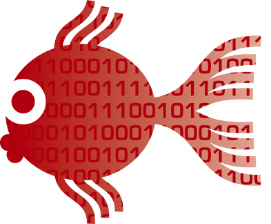
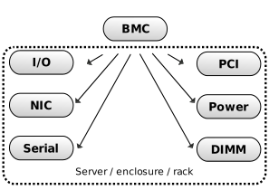
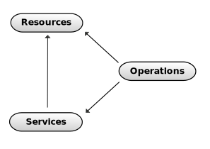
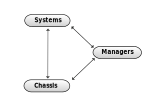
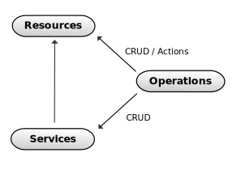

Redfish - future of hardware management
=======================================

*by Dmitry Tantsur and Ilya Etingof, Red Hat*

Why hardware management?
========================

Late night, you are in your bed:

* 4:00am - night shift calls - app is down
* 4:05am - reasons are still not clear
* 4:10am - your boss gives you 10 more minutes...

What's now? Scratch your head? Rub your eyes?

Hardware management to the rescue
=================================

* Get the console
* Boot from network
* Fix the problem

Management on scale
===================

* Large fleet of servers
* Mass deployment
* Frequent re-purposing
* Automation

How it works
============

* An independent satellite computer

How it works
============

* An independent satellite computer (BMC, Enclosure manager)
* Out-of-band access to the main system (or several systems)
* Many protocols, standard and proprietary

What is Redfish
===============

* Just a new hardware management protocol
* ...to eventually obsolete all others

Before the Redfish
==================

* IPMI (Intelligent Platform Management Interface)
* iLO (Oracle Integrated Lights Out Manager)
* iDRAC (Integrated Dell Remote Access Controller)
* AMT (Intel Active Management Technology)
* iRMC, CIMC, UCSM, and many more

Contest time!
=============

* Why "Lights Out Manager"?

Even earlier
============

* Remote KVM switches
* Serial console servers
* Remote circuit breakers
* In-band remote access: VNC, RDS

When it all started
===================

* Night shifts at the DC

Redfish design
==============

* RESTful(ish) API
* The oData schema
* Discoverability
* Multiple nodes capabilities

Redfish benefits
================

* Targeting universal adoption
* Human readable and self-documenting
* Tools readily available
* Standard way for OEM extensions

Redfish core components
=======================

Redfish resources
=================

* Systems (Servers)
* Chassis (Racks, Enclosures, Blades, etc.)
* Managers (BMC, Enclosure Manager, etc.)

Redfish System
==============

A System object represents a server.

Subresources:

* processors
* memory banks
* network adapters
* ... and many more

List systems
============

By HTTP GET'ing the resource:

.. code-block:: bash

   $ curl http://enclosure-A/redfish/v1/Systems
   {
      "Name": "Computer System Collection",
      "Members@odata.count": 4,
      "Members": [
         { "@odata.id": "/redfish/v1/Systems/blade-0" },
         { "@odata.id": "/redfish/v1/Systems/blade-1" },
         { "@odata.id": "/redfish/v1/Systems/blade-2" },
         { "@odata.id": "/redfish/v1/Systems/blade-3" }
      ]
   }

Read system resource
====================

Inventory data:

.. code-block:: bash

   $ curl http://enclosure-A/redfish/v1/Systems/blade-0
   {
      "Model": "3500RX",
      "SerialNumber": "437XR1138R2",
      "PartNumber": "224071-J23",
      "Description": "Web Front End node",
      "HostName": "web483",
      "Status": {
         "State": "Enabled",
         "Health": "OK",
      }
      ...

Read system resource
====================

Hardware properties:

.. code-block:: bash

      ...
      "ProcessorSummary": {
         "Count": 2,
         "ProcessorFamily": "Multi-Core Intel(R) Xeon(R) processor 7xxx Series",
         "Status": {
            "State": "Enabled",
            "Health": "OK"
         }
      },
      "MemorySummary": {
         "TotalSystemMemoryGiB": 2,
         "Status": {
            "State": "Enabled",
            "Health": "OK"
         }
      },

Read system resource
====================

System configuration:

.. code-block:: bash

   ...
   "IndicatorLED": "Off",
   "PowerState": "Off",
   "Boot": {
       "BootSourceOverrideEnabled": "Continuous",
       "BootSourceOverrideTarget": "Hdd",
       "BootSourceOverrideTarget@Redfish.AllowableValues": [
           "Pxe",
           "Cd",
           "Hdd"
       ],
       "BootSourceOverrideMode": "UEFI",
   },

Redfish operations
==================

Redfish actions
===============

.. TODO for etingof: show how available actions look (similar to OEM below)

Change boot sequence
====================

By HTTP PATCH'ing the resource:

.. code-block:: bash

   $ curl -d '{
           "Boot": {
               "BootSourceOverrideEnabled": "Once",
               "BootSourceOverrideTarget": "Pxe"
           }
       }'
       -H "Content-Type: application/json"
       -X PATCH
       http://enclosure-A/redfish/v1/Systems/blade-0

Power-on the machine
====================

By calling Action on the machine:

.. code-block:: bash

   $ curl -d '{
            "ResetType": "On"
        }'
       -H "Content-Type: application/json"
       -X POST
        http://enclosure-A/redfish/v1/Systems/blade-0/Actions/ComputerSystem.Reset

Redfish services
================

* Tasks (asynchronous operations)
* Sessions (web authentication)
* AccountService (service for managing users)
* EventService (alerting clients)

Extending Redfish
=================

* No standard can cover everything
* Idea: cover basics, allow extending
* Possibilities:
  * new top-level resources
  * extending existing resources

Redfish OEM extensions
======================

* Can add new fields, new actions, etc
* Contained in a "Oem" JSON field
  * ... in a vendor-specific namespace

Redfish OEM: fields
===================

.. code-block:: json

   "Oem": {
     "Contoso": {
       "@odata.type": "http://contoso.com/schemas/extensions.v1_2_1#contoso.AnvilTypes1",
       "slogan": "Contoso anvils never fail",
       "disclaimer": "* Most of the time"
     },
     "Contoso_biz": {
       "@odata.type": "http://contoso.biz/schemas/extension1_1#RelatedSpeed",
       "speed" : "ludicrous"
     }
   }
   
Here "Contoso" and "Contoso_biz" are vendors.

Redfish OEM: actions
====================

.. code-block:: json

   "Actions": {
     "OEM": {
       "Contoso.vx_x_x#Contoso.Ping": {
         "target":"/redfish/v1/Systems/1/Actions/OEM/Contoso.Ping"
       }
     }
   }

Swordfish: storage extension
============================

.. TODO

Redfish + YANG: networking
==========================

.. TODO

Redfish challenges
==================

* Wide adoption
* Feature bloat
* Incompatible extensions

Future of Redfish
=================

* Storage modelling
* Systems composability
* Software Defined Data Center
