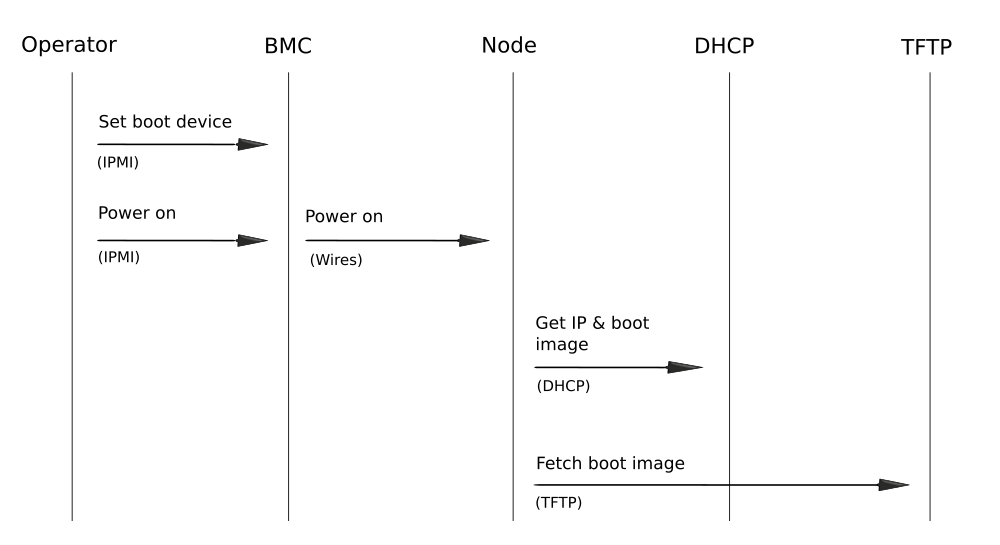
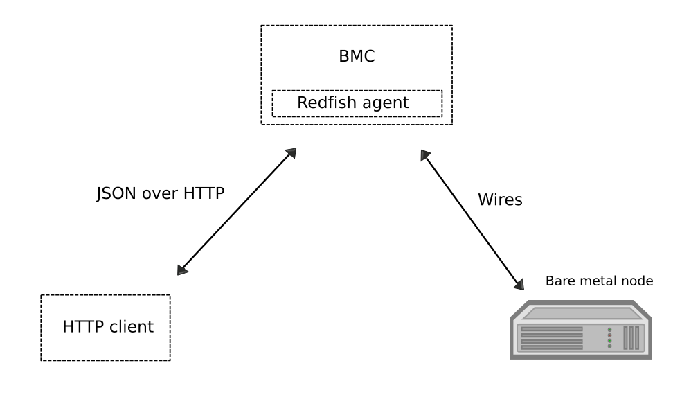
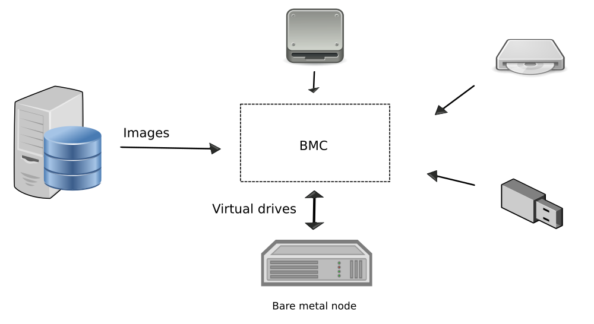
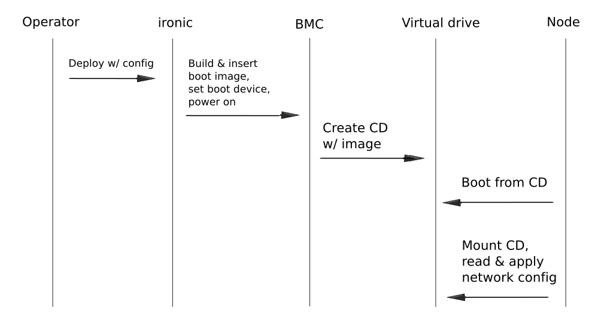

Bare Metal At The Edge
======================

*by Ilya Etingof, Red Hat*

In this talk
------------

* Edge Cloud vs Centralized Cloud
* Booting at the Edge
* Baremetal deployment demo

.. Things to talk about ^

    In this talk we will look into how the Edge cloud is different from the
    conventional, centralized cloud from the bare metal management
    perspective.

    We will be considering the challenges that bare metal machine management
    might run into when deploying machines at the edge of the cloud and ways
    to overcome these problems.

    Finally, I will play a short demo of a bare metal deployment with a OpenStack
    ironic as a stand-alone deployment tool.

Edge cloud
----------

.. Things to talk about ^

    It seems that now days, some of originally centralized cloud
    deployments transform into a more distributed layout.

    The reasons that drive this change are many. Just to mention a few:

    * Growth of IoT devices deployments pushes data collection and
      processing facilities closer to the data sources, i.e. IoT swarms.

    * The emergence of broadband content delivery services (such as 4k/8k
      video) pushes data storage facilities closer to the households.

    Stretching originally centralized infrastructure across slower, lossy and
    unreliable network affects some of hardware management procedures.

    Most importantly, that affects BMC access and node booting.

BMC access over unreliable network
----------------------------------

.. image:: bmc-access.png
   :align: center

.. Things to talk about ^

    BMC is a small satellite computer running its own OS. It’s
    always up and running and has intricate access to the components of the
    main system. For example, BMC can turn on/off power, change boot order,
    BIOS settings and many other things.

    Stretching control plane, including BMC access, worsens reliability and
    widens attach surface what raises security concerns.

Boot protocols are fragile
--------------------------

.. image:: edge-booting.png
   :align: center

.. Things to talk about ^

    The most basic operation of the cloud is instance allocation AKA scheduling.
    That also applies to the baremetal machines.

    Scheduling process typically runs a baremetal machine through one or
    more reboots and booting at the Edge may be risky.

PXE-boot work flow
------------------

.. Things to talk about ^

    Traditional way of booting a machine in the cloud is to rely on PXE suite
    of protocols. The typical process goes like this:

    * BMC sets node boot mode & boot device, then issues the power ON command.
      If this is done over IPMI, packet loss can fail or slow down any of
      these steps.

    * The node (or its NIC) broadcasts in search of a DHCP server on the local
      network. If successful, L3 connectivity is established. If not, the node
      fails booting.

    * The node pulls boot image over TFTP. If this fails, the node won't come
      up.

    Of course, there have been some improvements to the original PXE boot
    work flow (e.g. iPXE), however the weak point - reliance on DHCP is still
    there.

Why PXE-boot is unreliable?
---------------------------

* IPMI, DHCP & PXE over long, lossy network
* DHCP requires L2 connectivity by design
* Boot image transfer over TFTP is unreliable
* Security: image & node identification is hard to implement

.. Things to talk about ^

    IPMI and PXE suite of technologies has been designed decades ago targeting
    smaller, LAN-based networks. The original assumption seems to be that LAN
    is fast, reliable and reasonably secure.

    Some of LAN properties have been hardcoded into protocol design e.g. DHCP
    requires L2 broadcast functionality.

    PXE way of boot image transfer over network -- TFTP is optimized for smaller
    images, lossless network and heavily resource constraint client - network
    interface card. None of these assumptions hold with the edge cloud scenario.

    Finally, with PXE suite it is not easy for the infrastructure to reliably
    identify the node being booted to boot it in some specific way. Also, once
    the node is up and running, it is hard to tell one from the other because
    there is no reliable way to distinguish them.

A new way of booting
--------------------

* Redfish to replace IPMI and vendor-specific protocols
* Virtual media can replace PXE/TFTP and DHCP

.. Things to talk about ^

    The industry and cloud software development communities are trying to
    improve things addressing the most of these weak points.

    Specifically, Redfish has been designed and being adopted by large
    hardware vendors.

    Implemented within Redfish framework, virtual media boot is to replace
    PXE/TFTP phases.

What's Redfish?
---------------

.. Things to talk about ^

    Prior to Redfish, the only standard and mainstream OOB hardware management
    protocol used to be IPMI. The protocol dates back to late 90’s and shares
    similar weaknesses as PXE suite does.

    IPMI is not well-suited to manage baremetal machines over congested and
    lossy network. IPMI learning curve is quite steep, failure analysis
    requires protocol knowledge.

    With Redfish, everything is different. This new protocol has been
    designed around well-established protocols and tools widely used in
    everything web.

    That automatically ensures review scrutiny and timely maintenance.
    On top of that, people tend to understand how web works in the first
    place compared to less niche technologies.

    Technically, Redfish is a client-server system where the parties talk
    HTTP/S, exchange schema-guarded JSON documents over REST API.

What's virtual media?
---------------------

.. Things to talk about ^

    Virtual media boot is a function of BMC. BMC can emulate a large
    number of virtual media devices of various types (it's all
    imaginary!) and make them visible to the main system as local
    hardware.

    BMC then can be instructed to obtain a specific boot image one way
    or the other (HTTPS, NFS, SMB etc), and “insert” it into the imaginary
    virtual media device just like we (humans) slid a diskette and later
    CD disk into a PC.

    Finally, BMC can configure system BIOS to boot from the virtual media
    device of choice.

    All BMC communication is running over authenticated and encrypted
    HTTP/S connections. That includes controlling BMC and obtaining
    images.

Virtual media boot work flow
----------------------------

.. Things to talk about ^

    With virtual media, deployment workflow differs. Most importantly, it has
    no dependency on unreliable old-school protocols.

    The BMC operator inserts boot image into a virtual media device and
    powers on the node - all over Redfish.

    BMC operator power ons the node (over Redfish again) to boot deployed
    image from local CD.

OOB node configuration
----------------------

* With PXE, nodes are hardly distinguishable
* Virtual media as an OOB configuration method

  * Static network configuration
  * Secrets

.. Things to talk about ^

  Unfortunately, it's quite hard to distinguish one PXE-booting node from
  the other. One of the side-effects of virtual media service adoption is
  that we now know precisely which node we are booting. Based on that,
  we can confidently burn some node-specific information into boot ISO
  (or other virtual media).

  Most obvious examples include: user image static network configuration
  which would eliminate the need for user-facing DHCP service and some
  security materials such as tokens, private keys etc.

  We will see that shortly in the demo.

In the demo
-----------

.. Things to talk about ^

    In the upcoming demo:

    The user provides ironic with network configuration settings for both
    ironic agent and user instance OS in form of Nova network config metadata
    (network_data.json).

    Ironic writes network configuration as part of OpenStack config-drive onto
    boot ISO.

    Ironic sets the node to boot from virtual CD and powers on the node.

    Booting operating system initialization harness (e.g. cloud-init) discovers
    network configuration and applies it to the OS.

    This way no IPMI/PXE is ever involved.

Demo deployment workflow
------------------------

.. Things to talk about ^

Demo deployment
---------------

.. raw:: html

   <video controls src="_static/edge-deployment.mp4">Deployment at the Edge</video>

Summary
-------

* Edge cloud drives further innovation
* Redfish is the future of hardware management
* Open source projects are heavy players

.. Things to talk about ^

    Distributed cloud implementation becomes a new norm. Moving hardware
    to the outskirts of the infrastructure poses many difficulties and
    risks.

    In effort to mitigate the risks the industry comes up with a better
    suited hardware management protocol - Redfish.

    Open source community supports its use from their end by implementing
    it in free cloud software such as OpenStack.

Thank you!
----------

Learn more

* https://docs.openstack.org/ironic/latest/

Talk to us:

* openstack-discuss@lists.openstack.org
* #openstack-ironic @freenode
