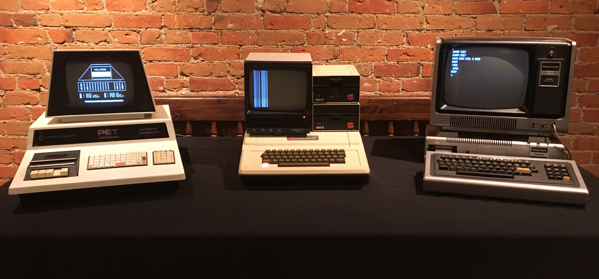
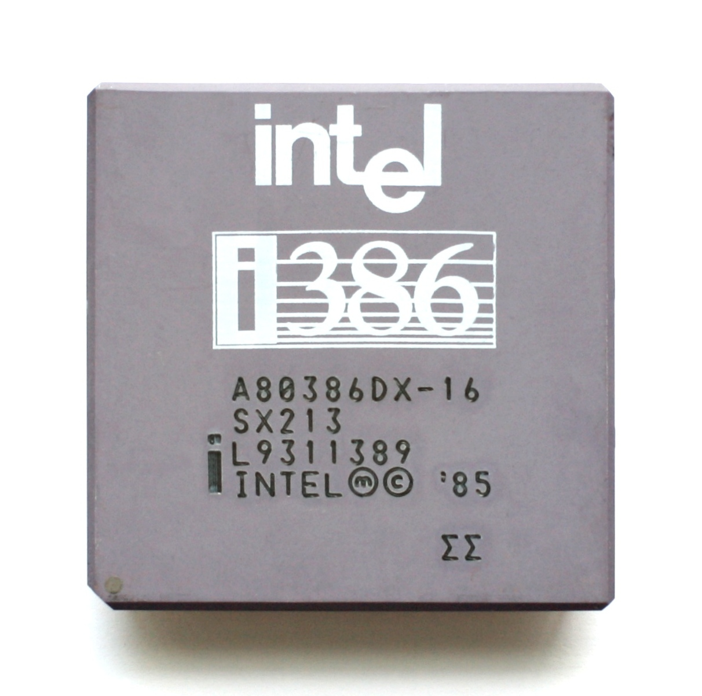
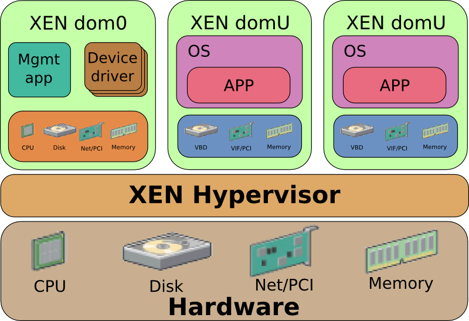

PA200 - Cloud Computing
=======================

Lecture 3: Virtualization technologies

Warm-up
-------

Let's rehearse on the previous lectures...

What's the cloud?
-----------------

1. Usage model of computer resources
2. Networked computers
3. Distributed computing technology
4. A collection of heterogeneous computers

.. Things to talk about ^

    Cloud computing is a model for enabling ubiquitous, convenient, on-demand
    network access to a shared pool of configurable computing resources
    (e.g., networks, servers, storage, applications, and services).

    Can be rapidly provisioned and released with minimal management effort or
    service provider interaction.

Cloud traits?
-------------

1. High availability
2. On-demand self-service
3. High performance
4. Broad network access
5. Resource pooling
6. Rapid elasticity
7. Measured service
8. Improved information security

.. Things to talk about ^

    2. On-demand self-service
      – Focuses on delivering IT services driven by user requests
      – No human interaction with the cloud provider
      – Cloud computing provides a means of delivering computing services that
        makes the underlying
        technology, beyond the user device, almost invisible

    4. Broad network access
      – Focuses on delivering IT services anytime, anywhere, and through
        user-chosen devices

    5. Resource pooling
      - Computing resources merged into pools for better utilization

    6. Rapid elasticity
      – Resources can be dynamically allocated and contracted based on the
        requirements of the underlying workload and the usage characteristics

    7. Measured service
      – Focuses on delivering IT services that can be metered for usage and
        charged for (if needed) through pricing models including subscription,
        usage pricing – Service level agreements (SLAs)

Cloud service models?
---------------------

1. Software as a Service
2. Application as a Service
3. Platform as a Service
4. Infrastructure as a Service
5. Data as a Service

.. Things to talk about ^

    1. Software as a Service (SaaS)
      - Metered use of pre-configured and hosted services

    3. Platform as a Service (PaaS)

      - Metered use of computing, storage or network services

    4. Infrastructure as a Service (IaaS)

      - Metered use of virtual infrastructure: virtual machines, storage or network devices etc.

Cloud deployment models?
------------------------

1. Public Cloud
2. Private Cloud
3. Hybrid Cloud
4. Personal Cloud
5. Community Cloud
6. Enterprise Cloud

.. Things to talk about ^

    1. Public Cloud
      - Commercial cloud services for many unrelated tenants

    2. Private Cloud
      - Company's own cloud

    3. Hybrid Cloud
      - Public and private cloud behind a single control plane

    5. Community Cloud
      - Free or members-only public cloud maintained by the community (RDO cloud)

In this lecture
---------------

* History of concurrency and virtualization
* Virtualization technologies
* Hypervisors
* Cloud software

History of virtualization
-------------------------

- Early 1960: batch processing
- 1970: first commercial time-sharing system - IBM S/370
- 2005: Intel VT-x, AMD-V - new instruction set
- 2005-: VMware, VirtualBox, KVM...

.. Things to talk about ^

   Virtualization can be seen as a form of concurrency.

   The idea of concurrent execution dates back in time. Let's explore its
   development and evolution starting from IBM mainframes through early
   desktop computers up to the contemporary hardware.

Mid sixties: S/360
------------------

IBM S/360: single-program, batched jobs

.. Things to talk about ^

    The most successful computer of the time, S/360 mainframe system, did not
    provide virtual memory and privilege separation at the CPU level. The
    mainstream computing model of the time has been about non-interactive,
    batched jobs.

Mid sixties: S/360
------------------

- Expensive idling on I/O

.. image:: punchcard.jpg
   :align: center
   :scale: 30%

Early seventies: TSS/360
------------------------

IBM TSS/360 & S/370 introduced virtual memory, privilege separation

- Eventually lost out to batch jobs
- Security concerns due to multi-tenancy

.. Things to talk about ^

    The concepts of concurrency have not been researched extensively until
    late sixties within the CP-40 project that eventually resulted in the
    first real and full virtualization support which appeared in IBM S/370-67
    in 1966.

    The major driving factor behind time-sharing system development was that,
    with batch processing, waiting for I/O was inefficient and program had to
    wait for the queue before the programmer can get a failure.

Late seventies: home computers
------------------------------

- One task at a time

Late seventies: home computers
------------------------------

- Tedious program entry

Early eighties: multitasking
----------------------------

- Intel 80286: protected operating mode
- "The brain-dead chip"

.. image:: 80286.jpg
   :align: center
   :scale: 45%

Mid-eighties: software virtualization
-------------------------------------

- Intel 80386: virtualization features
- Limited use due to software complexity

Early 2000: hardware virtualization
-----------------------------------

- Intel Pentium 4: Virtual Machine Extensions (VMX)
- Web-farms as a driving factor

.. Things to talk about ^

    In in PC world, the motivation for time-sharing features was not
    significant because PC CPUs were cheap enough to allocate to a single
    person.

    Many companies were coming up with desktop products offering virtualization
    features. But they were not hugely practical (due to complexity and low
    performance).

    However the rise of the Internet brought the emergence of huge farms of
    servers running applications like web sites. The load pattern of those
    was apparently similarly bursty as with mainframes and terminals.
    So running many different applications in parallel on the same system
    made more sense again.

    Around 2005 PC CPU vendors introduced new CPU instructions supporting
    virtualization - the Intel VT-x and AMD-V CPUs.

    By this moment practical virtualization has become possible.

Concurrency and isolation
-------------------------

Many forms of concurrency and isolation:

- Multi-programming
- Multi-tasking
- Multi-threading
- Virtual machines
- Containers
- CPUs:

  * Multi-core
  * Hyper-threading

.. Things to talk about ^

    At the batch-processing times, a form of parallelism was multi-programming
    -- the dynamic queue of tasks that get off the CPU when being blocked on I/O.

    Multi-tasking: OS gives each task (process) the impression that it is the
    only one running on the system and has full access to the system resources
    (memory, I/O). The crucial HW component for VM to work is MMU.

    Multi-threading: execution environment allows each process to run multiple
    code flows in parallel.

    Virtualization: each instance of the OS has the impression that it is the
    only OS running on the CPU/system and have full access to the system
    resources (e.g. each OS thinks that it has its own CPUs, memory, IO).

    Containers: give a set of tasks, the application, the impression that it is
    the only one running within the OS. Yet, containers share the same OS kernel
    instance.

    Not directly relevant to the topic of virtualization, but the other
    place where parallelism may be present is the CPU. With the advancements
    in the manufacturing processes, we now have multiple CPUs built into
    a single chip (multi-core CPU).

    The other trick is to virtualize the CPU itself - the hyper-threading
    technology presents multiple virtual CPU on top of a single physical
    CPU.

Concurrency: multi-programming
------------------------------

Sequential processes

.. image:: multi-programming.png
   :align: center

Software virtualization
-----------------------

- Resource access separation at CPU level

  - Memory protection, protection rings

- CPU scheduling

  - Cooperative
  - Preemptive
  - Real-time

- Intel 80286: protecting apps
- Intel 80386: protecting kernel and apps

Concurrency: multi-tasking
--------------------------

Concurrent processes

Concurrency: Multiple systems
-----------------------------

Multiple systems, concurrent processes

Concurrency: Multiple threads
-----------------------------

Multiple systems, concurrent processes, concurrent threads

Hardware virtualization
-----------------------

- The concept of VM at the HW level
- Resource protection and isolation
- Intel 80386: protecting kernel and apps
- Intel 80586: protecting hypervisor, kernel and apps

Concurrency: Virtual machines
-----------------------------

- Virtual machine emulates a physical computer
- OS executes within a VM
- Tenant OSes are isolated from each other
- VMs are heavy and expensive

.. Things to talk about ^

    VMs provide functionality needed to execute entire operating systems.
    A hypervisor uses native execution to share and manage hardware, allowing
    for multiple environments which are isolated from one another, yet exist
    on the same physical machine.

    Modern hypervisors use hardware-assisted virtualization,
    virtualization-specific hardware, primarily from the host CPUs.

    The physical, "real-world" hardware running the VM is generally referred
    to as the 'host', and the virtual machine emulated on that machine is
    generally referred to as the 'guest'. A host can emulate several guests,
    each of which can emulate different operating systems and hardware
    platforms.

Concurrency: Virtual machines
-----------------------------

Multiple systems, VMs, processes, threads

OS-level virtualization: containers
-----------------------------------

- Processes share the same kernel
- Processes have isolated memory, file system, network and PID spaces
- Many processes can be contained at once
- Containers are cheap and lightweight

.. Things to talk about ^

    A computer program running on an ordinary operating system can see all
    resources (connected devices, files and folders, network shares, CPU etc)
    of that computer. However, programs running inside a container can only
    see the container's portion of the file system and the devices assigned
    to it.

    The mechanism by which a host operating system runs programs in isolated
    user-space environments is called containerization or
    operating-system-level virtualization.

    Containers are based on the Linux control group subsystem. Beyond process
    isolation, cgroups can do resource limiting and accounting.

Concurrency: Containers
-----------------------

Multiple systems, VMs, containers, processes, threads

.. image:: containers.png
   :align: center

What makes up a cloud
---------------------

- Isolated execution environment

  * Virtual machines and/or
  * Containers

- Guest life cycle management

  * Hypervisors

- Higher order infrastructure

  * Instance management
  * Access control
  * Networking
  * Storage

.. Things to talk about ^

    In the context of the cloud, now days we use two forms of isolation and
    concurrency - VMs and/or containers.

    On top of that, to provide cloud services we need:

    - hypervisor(s) to control the lifecycle of the virtual machines
    - higher-level virtualization management infrastructure and additional
      services

Hypervisors
-----------

- Type 1: Native

  * Runs directly on host's hardware

- Type 2: Hosted

  * The hypervisor and VMs are processes of host's operating system

.. image:: hyperviseur.png
   :align: center
   :scale: 120%

.. Things to talk about ^

    A hypervisor is a software that creates and runs virtual machines.

    There exists two types of hypervisors:

    * Type 1 or bare-metal or native
    * Type 2 or hosted hypervisors

    Type 1 hypervisors run directly on the host's hardware to control the hardware
    and to manage guest operating systems.

    Type 2 hypervisors run on a conventional OS just as other computer programs
    do. A guest operating system runs as a process on the host. Type-2
    hypervisors abstract guest operating systems from the host operating system
    and vice versa.

    So why the thing is called "hypervisor"? It would probably be "supervisor"
    if the term was not already taken up for the operating system (which
    supervises the resources and the tasks). Thus, hypervisor which supervises
    tenant operating systems.

Example Type 1 hypervisors
--------------------------

Xen, Oracle VM Server, Microsoft Hyper-V, VMware ESX/ESXi

.. Things to talk about ^

    The first hypervisors, which IBM developed in the 1960s, were native
    hypervisors. Modern native hypervisors include: Xen, Oracle VM Server,
    Microsoft Hyper-V and VMware ESX/ESXi.

    Xen has been founded in 2003 by XenSource, bought in 2007 by Citrix, since
    2013 under Linux Foundation as Xen Project.

Example Type 2 hypervisors
--------------------------

VMware, Oracle VirtualBox, Parallels Desktop, Linux KVM (+QEMU), FreeBSD Bhyve

.. Things to talk about ^

    Modern hosted hypervisors include: VMware, VirtualBox, Parallels Desktop,
    KVM and bhyve.

    KVM is modular kernel virtualization, provides user space access to HW
    virtualization. Started by Qumranet, in 2007 merged into linux kernel.

    KVM is frequently used together with QEMU which provides CPU and/or hardware
    emulation.

Native-hosted hypervisors
-------------------------

- Type 1/2:

  * Linux KVM
  * BSD bhyve

.. Things to talk about ^

    The distinction between these two types of hypervisors is not necessarily
    clear.

    Linux's KVM and FreeBSD's bhyve are kernel modules that effectively convert
    the host OS to a type-1 hypervisor.

    At the same time, since Linux and FreeBSD are still general-purpose
    operating systems, with other applications competing for VM resources,
    KVM and bhyve can also be categorized as type-2 hypervisors.

Full or para-virtualization
---------------------------

- Full virtualization

  * Unmodified OS on top of hypervisor

- Para-virtualization

  * Modified OS calls hypervisor API

.. Things to talk about ^

    Hypervisers further sub-divide onto so-called full virtualization and
    para-virtualization capabilities.

    The latter involves modifying guest OS to call hypervisor's services
    explicitly instead of letting the hypervisor emulate hardware interfaces to
    the quest OS.

    Para-virtualization used to have more sense at the times when hardware
    support for virtualization has not been fully implemented.

Bare metal machine hypervisor
-----------------------------

- Traditional hypervisors

  * Manage VMs running on bare metal machines

- Baremetal machine hypervisors

  * Manager bare metal machines
  * In the same way as VMs

Full virtualization infrastructure
----------------------------------

- Basic cloud features

    * Hypervisor abstraction layer
    * User authentication and accounting
    * Instance life cycle management (scheduling)
    * Automated OS deployment and configuration
    * Virtualized network (SDN)
    * Storage services

- More features

    * High-availability services
    * Instance monitoring and scaling
    * Instance backup/migration
    * Virtualized databases
    * User interfaces

.. Things to talk about ^

    So far we end up having a way to invoke VMs on a host system. But:

    * There are many different hypervisors around, users want a single UI to
      them
    * Besides just firing up a VM users might need to deploy OS, configure
      networking etc
    * On top of that, we may need additional services that can be many

Example: oVirt
--------------

- Lightweight, all-in-one cloud (e.g. desktop)
- KVM as a hypervisor
- Reliable VMs (pets)
- Vertical scalability

.. Things to talk about ^

  oVirt offers a collection of virtual services normally present in the data
  center such as:
    * virtual machines that are the basis of the compute nodes
    * storage nodes
    * networking

    The user-facing GUI models a virtual data center where user can
    point-and-click to build their computing infrastructure.

Example: OpenStack
------------------

- Heavyweight, large cloud
- Large collection of loosely-coupled projects
- Unreliable, replaceable VMs (cattle)
- Horizontal scalability

OpenStack components
--------------------

.. image:: openstack-arch-brief.jpg
   :align: center
   :scale: 80%

.. Things to talk about ^

    OpenStack project offers similar services as oVirt, but at a way larger
    scale, flexibility and extensibility. With OpenStack one can spawn hundreds
    thousands of VMs scattered across the globe.

    OpenStack is designed as an open-ended collection of web-services
    interacting with each other to implement the workflow of VM lifecycle.

Container orchestration
-----------------------

- Basic features

    * Container runtime abstraction layer
    * Container life cycle management (scheduling)
    * Resource management: memory, CPU, file system, storage volumes,
      network addresses etc.
    * Clustering

- More features

    * Load balancing and scaling
    * Container images management
    * User interfaces

.. Things to talk about ^

   One of the interesting consequences (or driving factors) of the container
   revolution is that applications are now shipped fully deployed and configured,
   with all the dependencies in place.

   This creates another interesting consequence - it becomes quite hard to track
   the software being installed inside a container for security vulnerabilities.

Example: container orchestration
--------------------------------

- Docker Swarm
- Kubernetes / OpenShift
- Amazon EC2 Container Service
- Nomad

Nested virtualization
---------------------

Multiple systems, VMs, nested VMs, processes, threads

.. Things to talk about ^

    Nested virtualization becomes more necessary as widespread operating systems gain
    built-in hypervisor functionality, which in a virtualized environment can be used only
    if the surrounding hypervisor supports nested virtualization.

    For example, Windows 7 can run Windows XP applications inside a built-in virtual
    machine.

    Another (rasing) form of nested virtualization is when we run containers inside VMs.

Recap: the age of virtualization?
---------------------------------

1. IBM 700/7000, since 1952
2. CP-40 research project, early sixties
3. IBM S/370, 1970
4. Gameframes, since 2007
5. Intel VT-x, AMD-V, since 2005

Recap: virtualization technologies?
-----------------------------------

1. Multi-tasking
2. Multi-threading processes
3. Containers
4. Hyper-threading CPU
5. Multi-core CPU
6. Intel VT-x, AMD-V
7. Multi-programming

Recap: hypervisor types?
------------------------

1. Hybryd
2. Bare-metal
3. Native
4. Hosted
5. Para-hypervisor

Recap: what makes up a cloud?
-----------------------------

1. Baremetal machines w/ CPU-level virtualizaiton
2. Hypervisors
3. Cloud control plane / runtime
4. cloud services (storage, networking, etc)

Recap: virtualization vs containers?
------------------------------------

1. We can run OS in a container
2. We can run different OS'es in containers
3. Containers are more secure than VM
4. Containers consume less resources than VM
5. We can run Windows app in Linux container

Q&A
---

?
