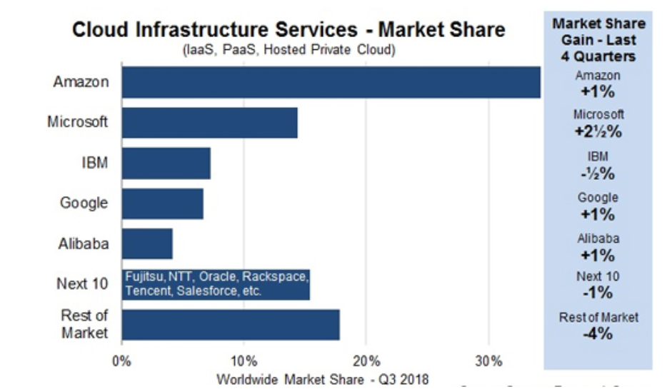

PA200 - Cloud Computing
=======================

Lecture 6: Cloud providers

*by Ilya Etingof, Red Hat*

In this lecture
---------------

* Cloud service providers

  - IaaS/PaaS/SaaS and variations
  - In the eyes of the user
  - Pros&Cons

* Google Cloud walk-through

Cloud software vs cloud service
-------------------------------

* Cloud software provider

  - OpenStack, RedHat OpenShift, oVirt
  - Many in-house implementations

* Cloud service provider

  - Amazon EC2
  - Microsoft Azure
  - Google Cloud Platform
  - RedHat OpenShift Online
  - ...

.. Things to talk about ^

What does CSP do?
-----------------

A combination of:

* IaaS
* PaaS/Stackless/FaaS
* SaaS

.. Things to talk about ^

   No strict specialization on service delivery model - any single CSP might
   offer many different service delivery models.

Business use of CSPs
--------------------

The hyperscalers:

.. Things to talk about ^

   The hyperscalers tend to offer the full stack of cloud services.

What does IaaS CSP do?
----------------------

* Abstracts away the hardware
* Operating system as a unit of scale

(before IaaS, hardware computer has been a unit of scale)

IaaS CSP business model
-----------------------

* Owns/rents physical DC infrastructure
* Owns/buys Internet connectivity (links, IX etc)
* Provides IaaS to end customers
* Serves other CSPs: PaaS and SaaS
* Base for multi-cloud CSPs

.. Things to talk about ^

   Perhaps first to appear and now days foundational kind of service.

Typical IaaS offering
---------------------

* Compute nodes (VMs)
* Virtual networks
* Bare metal nodes
* Managed storage (block, file systems)
* Instance-based scaling and redundancy
* Pay per allocated resources (instances, RAM, storage, traffic)

.. Things to talk about ^

Example IaaS
------------

* Amazon Elastic Compute Cloud (EC2)
* Google Cloud
* Microsoft Azure Cloud Computing Service

IaaS CSP differentiation
------------------------

* Technically interchangeable
* Similar costs
* Customer is not heavily locked-in

.. Things to talk about ^

   Hyperscalers try to differentiate on performance and a few other things, but at a
   fundamental level, IaaS is IaaS, and containers are containers.

Multicloud
----------

Multiple cloud services under the single control plane

* Reduces dependence on a single CSP
* Balances load/location/costs
* Gathers resources
* Same deployment model (unlike hybrid cloud)

.. Things to talk about ^

  CSPs are different, multicloud allows for picking the best pieces.

  Raises the complexity, security concerns and may lead to a paradox of choice.

Examples of multicloud software
-------------------------------

* IBM Cloud Orchestrator
* RedHat CloudForms
* Flexera RightScale

What does PaaS CSP do?
----------------------

* Abstracts away the OS
* Containerized application as a unit of scale

PaaS CSP business model
-----------------------

* Owns or rents the IaaS
* Maintains the platform
* Maintains services, data collections etc.

.. Things to talk about ^

Typical PaaS offerings
----------------------

* Application lifecycle management
* Application runtime environment
* Managed services through proprietary APIs
* Container-grain scaling and redundancy

.. Things to talk about ^

Example PaaS CSPs
-----------------

* AWS Elastic Beanstalk
* Azure App Service
* IBM Bluemix (IBM Cloud)
* Google Kubernetes Engine, AppEngine
* Heroku

.. Things to talk about ^

Example PaaS: Cloud Foundry
---------------------------

* Containerized applications
* Deployed in "buildpacks"
* Java, Python, ruby, .NET, Go, PHP run times
* External access through service broker
* Microservices marketplace

.. Things to talk about ^

   Open source, publicly governed. Can be hosted on many IaaS.

   IBM Bluemix is based on Cloud Foundry.

Higher-level PaaS services
--------------------------

* Serverless
* Functions (FaaS)

.. Things to talk about ^

   FaaS - event driven, storage-less applications

What does Serverless do?
------------------------

* Abstracts away application runtime (no container anymore!)
* Assembled applications as a unit of scale

Example serverless: Google App Engine
-------------------------------------

* Python, Java, Go, PHP, Node.js run times
* Applications deployed through SDK
* Application is called on HTTP request, ends in 60 secs max
* Google Cloud Datastore access through GQL

.. Things to talk about ^

   Heavy vendor lock-in. Thus, AppScale to allow for migration off Google
   cloud onto any IaaS

What does FaaS do?
------------------

* Abstracts away language runtime
* Function as a unit of scale

FaaS
----

* Event driven applications
* Charged for run time, not instance sizes
* Scaling is event-driven, not instance-based

Example FaaS
------------

* Amazon Lambda
* Google Cloud Functions
* IBM Cloud Functions
* Azure Functions
* Oracle Fn Project

.. Things to talk about ^

   FaaS - event driven, possibly storage-less applications

Example FaaS: Google Cloud Functions
------------------------------------

* Fully managed language runtime (Node.js, Python etc)
* Events via HTTP or Pub/Sub
* Pay per use

.. Things to talk about ^

PaaS: managed services
----------------------

* Big Data
* Cloud AI
* IoT

Example PaaS AI services
------------------------

* Natural Language Text Analysis
* Translation API
* Vision API
* Video Intelligence
* Maps API

PaaS CSP differentiation
------------------------

* Technically unique and incompatible
* Customer can be locked-in

.. Things to talk about ^

   On the plus side, PaaS simplifies and speeds up the development.

   On the flip side, the run time environment can become sticky.

   There are certain efforts to abstract away or standardize PaaS.

What does SaaS CSP do?
----------------------

* Managed application
* Subscription-based, no licensing fees
* No deployment phase
* User access from a thin client
* Online integration with company's IS

  - Portals vs Mashups

.. Things to talk about ^

   The idea of SaaS dates back to early 60th with IBM mainframes. Later on, in 90th the ASP
   business has been conceived.

   The key driver (from the economy perspective) is the ability to compete with the on-premises software.

   Technically, SaaS is promoted by the advances in broadband connectivity, browser advances and
   https adoption.

   Internally, SaaS is a multitenant application.

   Employs open integration protocols to have access to company's internal resources. The umbrella
   applications - mashups: combine data from multiple sources on the client side.

SaaS benefits & challenges
--------------------------

Pro:

* Can be easier, cheaper or free to use
* Unlimited storage/processing capabilities
* Rolling upgrades

Contra:

* Data ownership
* Access reliability and latency
* Abrupt product EOL

SaaS applications
-----------------

* Office and collaboration tools
* Payroll and HR systems
* Development and engineering software (CAD)
* Customer relationship management (CRM)
* Enterprise resource planning (ERP)
* Content management (CM)
* Geographic Information Systems (GIS)

.. Things to talk about ^

  Vertical and horizontal SaaS.

Example SaaS
------------

* Office365: tools for business
* Slack & Salesforce: collaboration tools
* Workday: HR tools
* ServiceNow: enterprise automation
* Shopify: e-shops
* Veeva Systems: pharmaceutical

Let's deploy an app
-------------------

In Google Cloud:

* VM
* Container
* AppEngine
* Function

IaaS: Google Compute
--------------------

1. Create and install VM instance

  - Choose flavor, distro

1. Configure the instance

  - Install language runtime and dependencies
  - Install/configure DB etc.

3. Expose the VM & app to external traffic

  - Setup virtual network
  - Configure virtual router, public IP, DNS record
  - Update local firewall

PaaS: Google Kubernetes Engine
------------------------------

1. Create a Docker container image

  - Create Dockerfile
  - Pack app & dependencies into container
  - Upload container into the registry

2. Setup GKE

  - Setup a cluster
  - Create a pod of containers

3. Expose pod & app to external traffic

PaaS: Google AppEngine
----------------------

1. Create the `app.yaml` file describing the app

  - Specify language runtime
  - Requested resources (CPU cores, RAM, storage sizes)
  - Autoscaling boundaries

2. Deploy the source code

PaaS: Google Functions
----------------------

1. Select function runtime properties

  - Max RAM
  - Trigger: HTTP, messaging
  - Access URL

2. Upload source code

Recap: CSP's
------------

* Hyperscalers offer IaaS + PaaS + SaaS
* PaaS & SaaS base on IaaS from hyperscalers

Recap: many forms of PaaS
-------------------------

* Containers
* Serverless
* FaaS

Recap: cloud can be sticky
--------------------------

* Vendors want to lock you in
* PaaS is especially sticky

Recap: choice of cloud
----------------------

* Depends on technical requirements
* Desired degree of flexibility
* Overall cost of the scenario

Q&A
---

?
