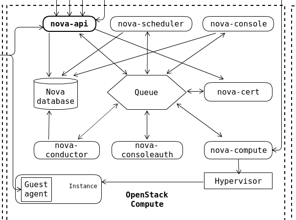
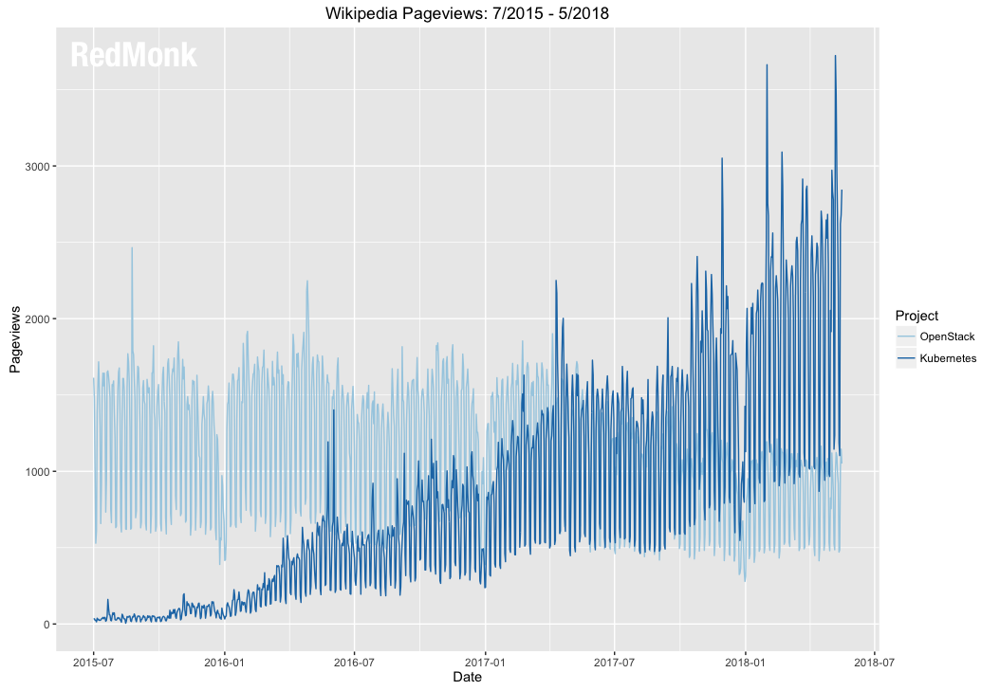
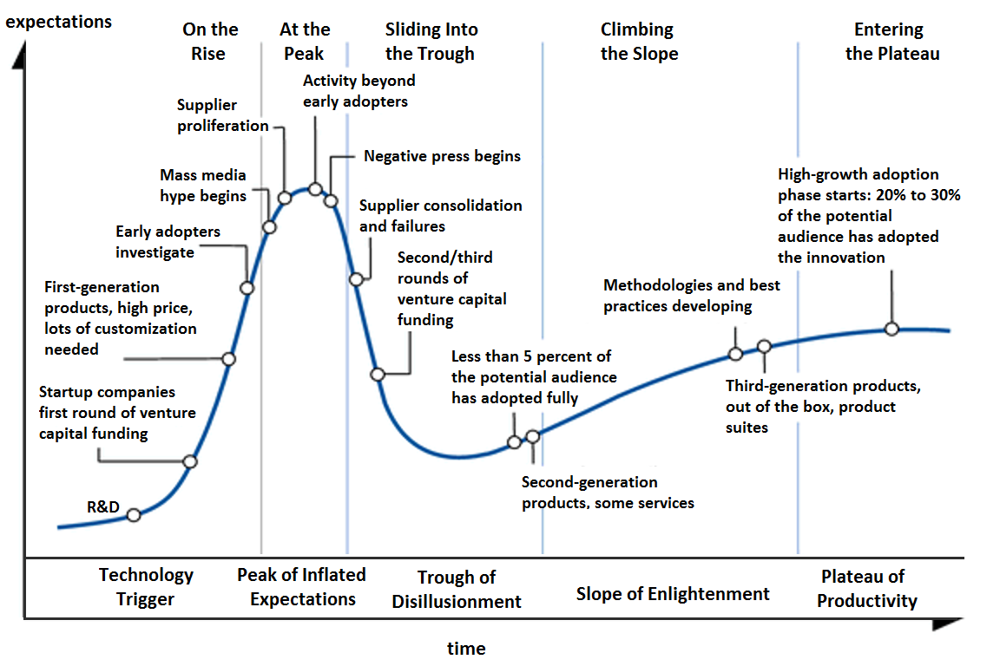

PA200 - Cloud Computing
=======================

Lecture 7: Introduction to OpenStack - history, design, and development

*by Petr Blaho and Ilya Etingof, Red Hat*

Warm-up
-------

Let's rehearse on the previous lectures...

Q: CSP's operational model?
---------------------------

1. Implement IaaS
2. Implement PaaS, consume IaaS
3. Implement SaaS & PaaS & IaaS
4. Implement IaaS, consume PaaS
5. Implement SaaS, consume PaaS
6. Implement SaaS & PaaS, consume IaaS

Q: Cloud abstraction levels?
----------------------------

1. Abstracts away the OS
2. Abstracts away application runtime
3. Abstracts away language runtime
4. Abstracts away the hardware
5. Abstracts away CPU

Q: Scaling by service model?
----------------------------

1. Operating system
2. Containerized application
3. Application instance
4. Function

Q: Cloud service model traits?
------------------------------

1. Best possible program isolation
2. Best possible security
3. Can run any OS on any architecture
4. Highest possible performance
5. Fastest spin-up
6. Majority of CSPs offer IaaS

Q: Cloud model by "stickiness"?
-------------------------------

* FaaS
* IaaS
* PaaS
* SaaS
* Serverless

Q: IaaS/PaaS/SaaS?
------------------

* Amazon EC2
* Google App Engine
* Google Cloud Functions
* Office365
* slack.com
* AWS Elastic Beanstalk
* RedHat Openshift Online
* IBM Bluemix
* Google Kubernetes Engine

In this lecture
---------------

- OpenStack demo (instance & infrastructure deploy)
- OpenStack key components
- Instance lifecycle
- Service structure
- OpenStack development model
- Competitors of OpenStack

Demo: request & launch a VM
---------------------------

- Choose VM configuration
- Choose OS to install on the VM
- Create the VM, boot the OS
- Log into VM and use it somehow
- Tier down the VM

Demo: Choose VM configuration
-----------------------------

.. code-block:: bash

    $ openstack flavor list
    +----+-----------+-----------+------+-----------+------+-------+-------------+
    | ID |    Name   | Memory_MB | Disk | Ephemeral | Swap | VCPUs | RXTX_Factor |
    +----+-----------+-----------+------+-----------+------+-------+-------------+
    | 1  | m1.tiny   | 512       | 0    | 0         |      | 1     | 1.0         |
    | 2  | m1.small  | 2048      | 10   | 20        |      | 1     | 1.0         |
    | 3  | m1.medium | 4096      | 10   | 40        |      | 2     | 1.0         |
    | 4  | m1.large  | 8192      | 10   | 80        |      | 4     | 1.0         |
    | 5  | m1.xlarge | 16384     | 10   | 160       |      | 8     | 1.0         |
    +----+-----------+-----------+------+-----------+------+-------+-------------+

Demo: Choose OS image
---------------------

.. code-block:: bash

    $ openstack image list
    +--------------------------------------+--------------+--------+
    | ID                                   | Name         | Status |
    +--------------------------------------+--------------+--------+
    | afa49adf-2831-4a00-9c57-afe1624d5557 | CentOS-6     | active |
    | 842c207f-6964-4ed7-a41a-06ec66a7c954 | Ubuntu-14    | active |
    | 30a2a55a-2045-4ed8-a605-2d1c1143edd3 | Ubuntu-16    | active |
    | 713f2fbc-05c5-491b-9e02-e000861e7b30 | Fedora-24    | active |
    | 5cb9c233-5867-4e47-80a1-9d774f800444 | Debian-7     | active |
    | f84868a5-5261-404a-9c54-ec317ea16b94 | CentOS-7     | active |
    | b105ad3b-7df8-4318-9c3d-4e4fa4cc4563 | Debian-8     | active |
    | b67b74bc-c3a8-4087-9c28-de02161fdedd | CoreOS       | active |
    +--------------------------------------+--------------+--------+

Demo: Create VM & boot OS
-------------------------

.. code-block:: bash

    $ openstack server create --flavor m1.small --key-name my_key \
        --network my_network --image CentOS-7 my_instance
    +------------------------+--------------------------------------+
    |        Property        |                Value                 |
    +------------------------+--------------------------------------+
    ...
    | id                     | 0e4011a4-3128-4674-ab16-dd1b7ecc126e |
    | status                 | BUILD                                |
    +------------------------+--------------------------------------+

Demo: List running VMs
----------------------

.. code-block:: bash

    $ openstack server list
    +---------+--------------+--------+-----------------------------------------------+
    | ID      | Name         | Status | Networks                | Image    | Flavor   |
    +---------+--------------+--------+-------------------------+----------+----------+
    | 76b3... | my_instance  | ACTIVE | my_network=192.168.1.23 | CentOS-7 | m1.small |
    +---------+--------------+--------+-------------------------+----------+----------+

Demo: Log into VM
-----------------

.. code-block:: bash

    $ ssh centos@192.168.1.23
    my_instance $ ls -a
    .ssh/
    my_instance $ pwd
    /home/centos
    my_instance $

Demo: Tier down VM
------------------

.. code-block:: bash

    $ openstack server delete my_instance

Deploy the infrastructure
-------------------------

- Express desired setup in HEAT template
- Evaluate HEAT template with OpenStack

Demo: Write HEAT template (1/2)
-------------------------------

.. code-block:: yaml

    heat_template_version: 2014-10-16

    description: Deploy a compute instance with an attached volume

    resources:
      my_instance:
        type: OS::Nova::Server
        properties:
          key_name: my_key
          image: CentOS-7
          flavor: m1.small
          networks:
            - network: my_network
    ...

Demo: Write HEAT template (2/2)
-------------------------------

.. code-block:: yaml

      ...
      my_attachment:
          type: OS::Cinder::VolumeAttachment
          properties:
            instance_uuid:  { get_resource: my_instance }
            volume_id: { get_resource: my_volume }
            mountpoint: /dev/vdb

      my_volume:
        type: OS::Cinder::Volume
        properties:
          size: 10

Demo: Create a stack
--------------------

.. code-block:: yaml

    $ openstack stack create -t my-template.yaml my-stack
    +---------------------+---------------------------------------------------+
    | Field               | Value                                             |
    +---------------------+---------------------------------------------------+
    | id                  | f81ec642-96b6-4540-b323-d5184327ae34              |
    | stack_name          | my-stack                                          |
    | description         | Deploy a compute instance with an attached volume |
    | creation_time       | 2019-04-08T16:12:36Z                              |
    | updated_time        | None                                              |
    | stack_status        | CREATE_IN_PROGRESS                                |
    | stack_status_reason | Stack CREATE started                              |
    +---------------------+---------------------------------------------------+

Demo: Inspect stack (1/4)
-------------------------

.. code-block:: yaml

    $ openstack stack list
    +---------+-------------+-----------------+----------------------+--------------+
    | ID      | Stack Name  | Stack Status    | Creation Time        | Updated Time |
    +---------+-------------+-----------------+----------------------+--------------+
    | f81e... | my-stack    | CREATE_COMPLETE | 2019-04-08T16:12:36Z | None         |
    +---------+-------------+-----------------+----------------------+--------------+

Demo: Inspect stack (2/4)
-------------------------

.. code-block:: yaml

    $ openstack stack event list my-stack
    2019-04-08 16:12:38Z [my-stack]: CREATE_IN_PROGRESS Stack CREATE started
    2019-04-08 16:12:38Z [my-stack.my_instance]: CREATE_IN_PROGRESS state changed
    2019-04-08 16:12:39Z [my-stack.my_volume]: CREATE_IN_PROGRESS state changed
    2019-04-08 16:12:41Z [my-stack.my_volume]: CREATE_COMPLETE state changed
    2019-04-08 16:13:00Z [my-stack.my_instance]: CREATE_COMPLETE state changed
    2019-04-08 16:13:00Z [my-stack.my_attachment]: CREATE_IN_PROGRESS state changed
    2019-04-08 16:13:04Z [my-stack.my_attachment]: CREATE_COMPLETE state changed
    2019-04-08 16:13:04Z [my-stack]: CREATE_COMPLETE Stack CREATE completed successfully

Demo: Inspect stack (3/4)
-------------------------

.. code-block:: yaml

    $ openstack stack resource list my-stack
    +---------------+---------+--------------------------+----------+----------------------+
    | resource_name | ID      | resource_type            | status   | updated_time         |
    +---------------+---------+--------------------------+----------+----------------------+
    | my_volume     | 2fc5... | OS::Cinder::Volume       | COMPLETE | 2019-04-08T16:12:38Z |
    | my_attachment | 2fc5... | OS::Cinder::VolumeAttach | COMPLETE | 2019-04-08T16:12:38Z |
    | my_instance   | 8263... | OS::Nova::Server         | COMPLETE | 2019-04-08T16:12:38Z |
    +---------------+---------+--------------------------+----------+----------------------+

Demo: Inspect stack (4/4)
-------------------------

.. code-block:: bash

    $ openstack server list
    +---------+--------------+--------+-----------------------------------------------+
    | ID      | Name         | Status | Networks                | Image    | Flavor   |
    +---------+--------------+--------+-------------------------+----------+----------+
    | 8263... | my_instance  | ACTIVE | my_network=192.168.1.23 | CentOS-7 | m1.small |
    +---------+--------------+--------+-------------------------+----------+----------+

Demo: Delete stack
------------------

.. code-block:: yaml

    $ openstack stack delete my-stack
    Are you sure you want to delete this stack(s) [y/N]? y
    $ openstack stack list
    $ openstack server list
    $

OpenStack design
----------------

- A collection of loosely coupled services
- Interacting over REST APIs
- Using well-defined protocols
- Each service is a project backed by a team

OpenStack key services
----------------------

- Compute service - Nova
- Network service - Neutron
- Image service - Glance
- Object Storage service - Swift
- Identity service - Keystone

Core OpenStack services
-----------------------

.. image:: openstack-arch-brief.jpg
   :align: center
   :scale: 80%

Instance deployment workflow (1/3)
----------------------------------

- Heat engine executes a template
- Heat asks Nova to schedule an instance
- Nova asks Glance for a boot image (pre-created)
- Glance asks Swift for image contents
- Heat asks Cinder for volume
- Nova asks Neutron for network (pre-created)

Instance deployment workflow (1/3)
----------------------------------

.. image:: openstack-arch-medium.png
   :align: center
   :scale: 60%

Instance deployment workflow (3/3)
----------------------------------

.. image:: openstack-arch-detailed.png
   :align: center
   :scale: 40%

OpenStack service structure (1/2)
---------------------------------

- Message queue
- Persistent database
- REST API service
- Service engine
- Remote agent

OpenStack service structure (2/2)
---------------------------------

OpenStack services (1/2)
------------------------

- Orchestration - Heat
- Baremetal provisioning - Ironic
- Non/relational database service - Trove
- Dashboard - Horison
- Block Storage - Cinder
- Telemetry - Ceilometer

OpenStack services (2/2)
------------------------

- Elastic Map Reduce - Sahara
- Messaging Service - Zaqar
- Shared Filesystems - Manila
- DNS Service - Designate
- Key Management - Barbican
- Containers - Magnum
- Application Catalog - Murano
- Governance - Congress

OpenStack history
-----------------

- Rackspace and NASA teamed up to rewrite infrastructure code
- First design Summit in 2010
- First release "Austin" in 2010 (Nova + Compute)
- OpenStack Foundation in 2012

OpenStack releases (1/2)
------------------------

* Train - 2019-10-16 (estimated)
* Stein - 2019-04-10
* Rocky - 2018-08-30
* Queens - 2018-02-28
* Pike - 2017-08-30
* Ocata - 2017-02-22
* Newton - 2016-10-06
* Mitaka - 2016-04-07
* Liberty - 2015-10-15
* Kilo - 2015-04-30

OpenStack releases (2/2)
------------------------

* Juno - 2014-10-16
* Icehouse - 2014-04-17
* Havana - 2013-10-17
* Grizzly - 2013-04-04
* Folsom - 2012-09-27
* Essex - 2012-04-05
* Diablo - 2011-09-22
* Cactus - 2011-04-15
* Bexar - 2011-02-03
* Austin - 2010-10-21

OpenStack operators (1/3)
-------------------------

Superuser award finalists:

* AT&T
* CERN
* COMCAST
* NTT
* Workday
* DreamHost
* Betfair

OpenStack operators (2/3)
-------------------------

* T-Mobile
* Volkswagen AG
* Bloomberg
* Verizon
* Walmart
* China Mobile
* ... and thousands of others

OpenStack operators (3/3)
-------------------------

One of the largest deployments by PayPal

* Number of VMs: 82,000
* Number of CPU cores: 400,000
* Number of bare metal: ~5000 (?)

OpenStack development
---------------------

In the year 2018:

* 65000 commits
* 1972 developers
* 182 changes/day for Rocky cycle
* Biggest contributions from US and China

OpenStack challenges
--------------------

* Installation requires skills
* Documentation can be lacking/outdated
* Upgrades require skills and are risky
* Long-term support is lacking upstream

OpenStack governance
--------------------

The pillars:

- Open source
- Open community
- Open design
- Open development

Open source
-----------

- Functional out-of-the-box
- No vendor-specifics built-in
- Apache 2.0 License

Open community
--------------

- Public meetings on Freenode (IRC)
- Mailing lists, bugs on http://storyboard.openstack.org
- Elected Project Team Lead
- Elected Technical Committee

Open design
-----------

- OpenStack Summit (operators)
- Project Team Gatherings (developers)
- OpenStack Forum (operators and developers)

Open development
----------------

- Git and Gerrit - https://review.openstack.org/
- Blueprints - https://specs.openstack.org/
- Zuul as CI - https://zuul-ci.org/
- Project Team Lead
- Core Reviewers

Future of OpenStack (1/3)
-------------------------

Future of OpenStack (2/3)
-------------------------

Future of OpenStack (3/3)
-------------------------

- Integration with PaaS (containers)
- Software Defined Networking / Network Function Virtualization
- Bare metal
- Edge deployments (IoT, CDN)

Recap: OpenStack is... (1/3)
----------------------------

* Established IaaS implementation
* Can provide virtual infrastructure
* Driven by HEAT or REST API automation (e.g. Ansible)
* A large and fluid collection of projects
* Projects are loosely unified

Recap: OpenStack is... (2/3)
----------------------------

Projects are frequently composed from:

* REST API
* Database
* Business logic engine
* Message bus

Recap: OpenStack is... (3/3)
----------------------------

* Free, open, community driven IaaS
* Fully open and democratic
* Everyone can use and contribute to OpenStack
* OpenStack is being in transition

Questions?
----------

https://www.openstack.org/
