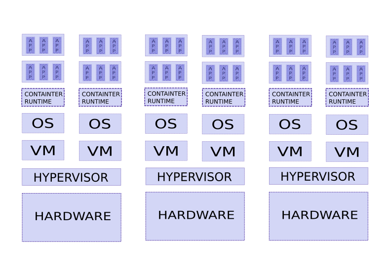

PA200 - Cloud Computing
=======================

Lecture 10: Cloud software architecture and containers

*by Ilya Etingof, Red Hat*

Warm-up
-------

Let's rehearse on the previous lectures...

Using OpenStack
---------------

* Spawn a single virtual machine
* Deploy the infrastructure

HEAT orchestration engine
-------------------------

* HOT templates render stacks
* Resources stack up to infrastructure
* HEAT takes HOT template(s) + environment

HOT resources
-------------

.. code-block:: yaml

  my_server:
    type: OS::Nova::Server
    properties:
      image: { get_param: image_id }

HOT parameters
--------------

.. code-block:: yaml

    parameters:

      key_name:
        type: string
        default: my_key

      instance_type:
        type: string
        default: m1.small
        constraints:
          - allowed_values: [m1.tiny, m1.small, m1.medium,
           m1.large, m1.xlarge]

Create the infrastructure
-------------------------

.. code-block:: bash

    $ openstack --os-cloud muni-cloud stack create --wait \
            --template pa200.yaml pa200
    $ openstack --os-cloud muni-cloud stack list
    $ openstack --os-cloud muni-cloud stack show pa200

OpenStack administration
------------------------

* PackStack, Fuel etc
* TripleO

OpenStack-on-OpenStack (1/2)
----------------------------

* Deployment cloud: Undercloud
* Workload cloud: Overcloud

OpenStack-on-OpenStack (2/2)
----------------------------

.. image:: ooo-overview.png
   :align: center
   :scale: 140%

In this lecture...
------------------

* Cloud-naive software architecture
* Containers
* Container orchestration

On-premises applications (1/2)
------------------------------

* Monolithic
* Tied to the infrastructure
* Languages: a Visual Studio language, enterprise Java, Cobol
* Developed in a waterfall model

On-premises applications (2/2)
------------------------------

Problems:

* Hard to scale, migrate, distribute
* Risky updates
* Low code reuse

Cloud-native applications
-------------------------

* Modular and stateless
* Shared resources
* Elastic and redundant by design
* Web-service architecture
* Rolling updates
* Agile, DevOps, CI/CD

Cloud-native: modularity
------------------------

Microservices

.. image:: monolith-vs-cloud-app.png
   :align: center
   :scale: 80%

Cloud-native: multitenancy
--------------------------

Cloud-native: elasticity and redundancy
---------------------------------------

* Services accommodate work load
* Services migrate towards the clients
* Service instances ensure redundancy

Cloud-native: application design
--------------------------------

* Modular and task-specific
* Stateless - horizontally scalable
* REST API RPC
* Application databases
* Web-centric languages (Go, Python, Node.js, Ruby etc.)
* Configure from cloud

Cloud-native: rolling updates
-----------------------------

* Frequent, minor per-service updates
* Redundancy to replace updating instances
* CI/CD automation to ensure code quality

Cloud-native: team changes
--------------------------

* Service-centric teams

  - Cross-team collaboration

* Agile, minimal viable product development

  - Software developers <-> customers

* Software development & IT operations (DevOps)

  - System administrators <-> software developers

Cloud-native: tooling
---------------------

* Multiple teams - multiple tools
* Toolchains:

  - Source code management
  - Continuous integration and testing
  - Infrastructure as a code

Cloud-native: CI/CD
-------------------

* Continuous integration

  - Test every change

* Continuous delivery

  - Stage every change

* Continuous deployment

  - Automatic release

Cloud-native challenges
-----------------------

* Root cause analysis/debugging/testing
* Logging/monitoring
* Security
* Expensive changes to legacy apps & teams

Containers: agenda
------------------

* Concurrency and isolation
* OS-level virtualization
* Container orchestration

Concurrency and isolation
-------------------------

Multiple systems, VMs, containers, processes, threads

Containers vs VMs
-----------------

* Containers: share kernel
* VMs: share physical hardware

Linux containers
----------------

Based on kernel features:

* Namespaces present resources to process
* Cgroups govern resource isolation and usage
* Container is temporary and transient, much like a process

Examples: LXC, Docker, OpenVZ

Docker to manage containers
---------------------------

Docker concepts

* Dockerfile to build Docker image
* Docker image to run the container(s)
* Containers are live image instances

Docker features
---------------

* Container is temporary and transient, but it can be

  - deployed, suspended, replicated, moved, backed up etc.

* Docker Hub shares Docker images
* Docker Compose hitches containers on the same host
* Docker Swarm orchestrates multi-node deployments

  - Clustering, redundancy, load-balancing etc.

Container orchestration: Kubernetes (1/3)
-----------------------------------------

* Cluster

  - master + nodes (on bare metal or VMs)
  - nodes run pods

* Pods

  - Pod contains one+ containers
  - Application runs in its pod

* Controllers

  - Pod management logistics (e.g. Deployment, StatefulSet)

* Services

  - Represent application to the world

Container orchestration: Kubernetes (2/3)
-----------------------------------------

Container orchestration: Kubernetes (3/3)
-----------------------------------------

.. image:: kubernetes-arch.png
   :align: center
   :scale: 80%

Kubernetes pros&cons
--------------------

+ Automates application maintenance

  - Deployment (e.g. Helm), health, balances load, resilience

+ Simplifies management of shared resources

  - Storage, secrets etc.

+ Utilizes hardware resources

  - Soft & hard limits per-app

- Learning curve is high

Kubernetes vs Docker
--------------------

* Docker (prior to Swarm) builds and run containers locally
* Kubernetes orchestrates multiple nodes
* Docker and Kubernetes may or may not be used together

The alternatives
----------------

* Alternatives to Docker

  - rkt, LXC etc.

* Alternatives to Kubernetes

  - Docker Swarm, Apache Mesos etc.

Containers are on the rise
--------------------------

* Facilitates microservices design
* Portability
* Composability and throttling
* Easy scaling

Containers challenges
---------------------

* Keeping software up to date is difficult
* Isolation can be insufficient
* Overhead can be noticeable

Recap: cloud software architecture
----------------------------------

* Requires changes in software design towards:

  - Modularity
  - Statelessness
  - Automatic testability

* Requires changes in team work

  - Team focusing on service
  - Agile, MVP
  - DevOps

Recap: containers
-----------------

- Container for concurrency and isolation
- Docker for container lifecycle automation
- Kubernetes for container-based clouds

Questions
---------

?
