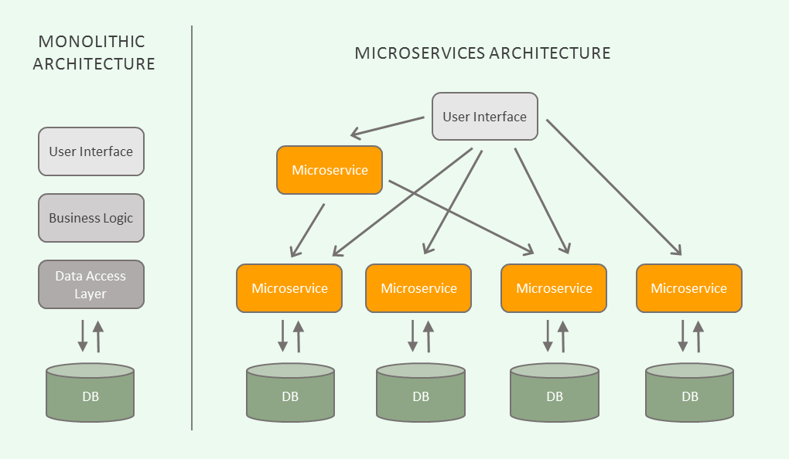

PA200 - Cloud Computing
=======================

Lecture 11: Future directions in cloud computing

*by Ilya Etingof, Red Hat*

Warm-up
-------

Let's rehearse on the previous lectures...

On-premises applications
------------------------

* Monolithic
* Tied to the infrastructure
* Languages: a Visual Studio language, enterprise Java, Cobol
* Developed in a waterfall model

Cloud-native applications
-------------------------

* Modular and stateless
* Shared resources
* Elastic and redundant by design
* Web-service architecture
* Rolling updates
* Agile, DevOps, CI/CI

Microservice architecture
-------------------------

Linux containers
----------------

* Form of concurrency and isolation
* Based on kernel features

  - Control groups
  - Namespaces

* Container orchestration

Container orchestration software
--------------------------------

* Makes containers usable
* Docker - single node containers

  - Builds container image (file system)
  - Runs image as a container instance

* Kubernetes - multinode container cloud

  - Extends Docker over multiple hosts
  - Introduces cloud features

In this lecture...
------------------

* Future directions and challenges in cloud computing
* Course summary and walk through

Future directions
-----------------

* Internet of Everything, Edge/Fog computing
* Containers as a unit of software distribution and deployment
* Serverless & FaaS

Edge computing (1/3)
--------------------

* Internet of Things / Internet of Everything

  - Smart homes / smart cities
  - Connected cars / public transport
  - Health care
  - ...

* Localized data

  - High-bandwidth media
  - AI/ML

Edge computing (2/3)
--------------------

Stretching the cloud

* Move processing and storage units closer to consumers
* Automate cloud maintenance at the edge (e.g. bare metal)
* Protect larger attack surface

Edge computing (3/3)
--------------------

.. image:: edge-cloud.png
   :align: center
   :scale: 100%

Containers and PaaS (1/2)
-------------------------

* Container images for software distribution
* CSP unification on Kubernetes
* Containers on the bare metal

Containers and PaaS (2/2)
-------------------------

.. image:: containers-on-baremetal.jpg
   :align: center
   :scale: 80%

Serverless & FaaS (1/2)
-----------------------

* FaaS keeps gaining popularity
* Emerging serverless databases

Serverless (2/2)
----------------

Conclusions
-----------

* Long way towards concurrency and isolation
* Cloud is powering almost everything
* OpenStack for IaaS, Docker/Kubernetes for PaaS
* Cloud keeps evolving

Rehearsal
---------

* Virtualization technologies
* Cloud providers
* Introduction to OpenStack
* Cloud administration and software development
* Cloud software architecture and containers

What's virtualization
---------------------

* Form of computation concurrency and isolation
* Dates back to early mainframes
* Progressed through

  - Batch jobs
  - Multitasking
  - Multithreading
  - OS virtualization
  - Containers

What's hypervisor
-----------------

* Performs virtual machines lifecycle management
* Two types: native and hosted
* Technologies: full and para-virtualization
* Nested virtualization

CSP roles
---------

* CSP can do IaaS, PaaS, SaaS
* IaaS CSP abstract away hardware
* PaaS CSP abstract away OS
* PaaS/Serverless CSP abstract away application runtime
* PaaS/FaaS CSP abstract away language runtime
* SaaS CSP offer managed applications

OpenStack basics
----------------

* OpenStack is a free and open source IaaS software
* Operates on VMs (instances)
* HEAT engine consumes HOT templates to build infrastructure
* Key projects

  - Nova, Glance, Swift, Neutron, Heat, Cinder

Technology behind OpenStack
---------------------------

* Based on open protocols
* Consists of many loosely coupled services
* Each service typically contains

  - Service engine
  - REST API engine
  - Persistent database
  - RPC e.g. message queue

OpenStack pillars
-----------------

* Open source
* Open community
* Open design
* Open development

Cloud-native applications
-------------------------

* Modular and stateless
* Shared resources
* Elastic and redundant by design
* Web-service architecture
* Rolling updates
* Agile, DevOps, CI/CI

Container orchestration
-----------------------

* Linux containers base on kernel features:

  - Control groups
  - Namespaces

* Docker builds, shares and runs container images on a host
* Kubernetes can base on Docker to create container cloud

Kubernetes basics
-----------------

* Cluster

  - master + nodes (on bare metal or VMs)
  - nodes run pods

* Pods

  - Pod contains one+ containers
  - Application runs in its pod

* Controllers

  - Pod management logistics (e.g. Deployment, StatefulSet)

* Services

  - Represent application to the world

We are done
-----------

Thank you!
