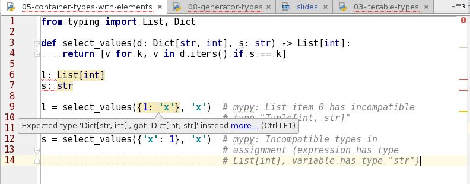

.. Type hinting hands-on slides file, created by
   hieroglyph-quickstart on Sat Oct 22 15:06:37 2016.

Type hinting hands-on
=====================

*by Ilya Etingof*

Agenda
======

* Variables, types and their interplay
* Why type checking?
* Function and variable annotations
* Type hints
* Practicing Python gradual typing (you will need Python 3.6!)

What is a variable?
===================

BTW, that's an interview question! ;-)

Variable is:
============

* Storage + name
* Name gets hold of stored data/code
* Introduces scoping and inheritance
* Type defines a way to structure and interpret data

Concepts of Type:
=================

Many ways to define what Type is:

* ...based on all possible values
* ...based on all operations that could be performed on variables of given Type (AKA duck typing)

May get incredibly complicated.

Demystifying the buzzwords
==========================

* Static vs Dynamic: name<->storage type [re]binding
* Strong vs Weak: degree of automatic value adaptation

.. code-block:: python

    x = 1      # `x` name points to integer object
    x = '1'    # now repoint `x` to a string object -- that's dynamic

    x += 1     # fails on `+` operation -- sign of strong typing
    x += b'0'  # but this succeeds -- sign of weak typing

Strong vs weak typing
=====================

It is not either strong or weak...

========= ==================================== =====================================================
    -               Strong Typing                                       Weak Typing
========= ==================================== =====================================================
  Good      Reliable                             Convenient
  Bad       More work for programmer             Error prone
  Details   Prefers dealing with similar types   Goes to great lengths automatically adapting values
========= ==================================== =====================================================

Static vs dynamic typing
========================

If it is not either static or dynamic, then it is *gradual*!

====== ========================== ====================
   -              Static                 Dynamic
====== ========================== ====================
  Good   Reliably determines type   Less work
  Bad    More work                  Hard to infer type
====== ========================== ====================

Type checking
=============

Two steps, typically at compile time:

1. Figure out what type given variable belongs to (easy with static typing)
2. Decide would it be safe to carry out given operation on that variable (easier with strong typing)

The more dynamic and weak typed the language is, the harder it is to determine
type consistency precisely and reliably.

Type consistency
================

When it is safe to carry out an operation on a variable of given type?

* Variables of the same type are always safe to deal with
* Variables of different types? It depends...

.. code-block:: python

    fractional_numbers = [0.0, 255.0, 65535.0]
    natural_numbers = [255, 5125]
    real_numbers = fractional_numbers + natural_numbers

    def divide_by_256(numbers):
        return [number >> 8 for number in numbers]

    # is it safe to bit-shift integers, floats?
    result = divide_by_256(real_numbers)

Subtype relationships
=====================

`T2` is a subtype of `T1` if:

* Any possible value of `T2` also belongs to values of `T1` and
* Any operation allowed on `T1` also works on `T2`

.. code-block:: python

    t1 = t2  # safe
    t2 = t1  # unsafe

When `T2` is a subtype of `T1`:

* Evety type is also a subtype of itself
* The set of `T2` values may only be smaller
* The set of operations on `T2` may only be larger

Computing subtype relationships
===============================

Approaches:

* By relationships (inheritance)
* By interface (duck typing)

Both are implemented in *typing.py* (Python 3.5+) and *MyPy*.

Gradual typing in Python
========================

Implementation based on two otherwise independent features:

* Function and variable annotations (introduced in 2006)
* Type hints (part of Python 3.5 since 2015)

Annotations
===========

* Python expressions attaching arbitrary (!) objects to names
* Can annotate function parameters, return values, variables
* 100% optional, no predefined semantics
* Python 3: part of the language
* Python 2: mini-language embedded into comments

Function and variable annotations
=================================

* Function parameters: optional expression following parameter name
* Function return: optional expression following '->' token
* Global, local, class variable: optional expression following name

.. code-block:: python

    # foo(identifier [: expression] [= expression]): [-> expression]
    def foo(bar: 'bar goes in') -> 'bar goes out':
        return bar

    # identifier [: expression] [= expression]
    y: 'ordinate = 1

Annotation examples
===================

.. literalinclude:: /../code/01-annotations/00-documentation.py
   :language: python

*File: code/01-annotations/00-documentation.py*

.. nextslide::

.. literalinclude:: /../code/01-annotations/01-computed.py
   :language: python

*File: code/01-annotations/01-computed.py*

.. nextslide::

.. literalinclude:: /../code/01-annotations/02-introspection.py
   :language: python

*File: code/01-annotations/02-introspection.py*

Type hints
==========

A collection of Python classes designed to:

* Represent built-in and custom types to type checker
* Compute type consistency

Type hints classes
==================

* Part of Python 3.5 (the `typing` module)
* Designed for type checker use only (a separate program)
* Should never be instantiated by user code
* Do not impose performance penalties or compatibility issues

Type annotations
================

This is where ends meet: annotating function and variables with
either regular Python types:

.. code-block:: python

    def factorial(n: int) -> int:
        if n == 0:
            return 1
        else:
            return n * factorial(n-1)

.. nextslide::

...or type hints classes (to capture the semantics of more complex types):

.. code-block:: python

    from typing import List

    def list_multiplication(l: List[int], n: int) -> List[int]:
        return [x*n for x in l]

    n = list_multiplication([1, 2, 3], 10)

Inferring types
===============

Type checker can sometimes spot an issue in a fully dynamic code

.. literalinclude:: /../code/02-type-hints/00-inferring-types.py
   :language: python

*File: code/02-type-hints/00-inferring-types.py*

Typing based on class hierarchy
===============================

* Each Python class can serve as a type hint to type checker
* Everything is an object, class is an object factory
* Any instance of a subclass is consistent with all superclasses
* All values are compatible with the `object` type

Typing built-ins
================

.. literalinclude:: /../code/02-type-hints/01-builtin-types.py
   :language: python

*File: code/02-type-hints/01-builtin-types.py*

Typing user classes
===================

.. literalinclude:: /../code/02-type-hints/02-user-types.py
   :language: python

*File: code/02-type-hints/02-user-types.py*

Typing based on ABC
===================

* Class hierarchy based type checking is too rigid
* Abstract Base Classes capture interfaces (e.g. qualities), not relationships
* ABCs from modules `collections.abc` or `typing` can be used in type hinting

Fundamentals: Any
===========================

* Non-hinted variables belong to `Any` type
* `Any` is a subclass of `object`
* `object` is a subclass of `Any`

.. code-block:: python

    from typing import Any

    issubclass(object, Any)  # yields True
    issubclass(Any, object)  # yields True

Fundamentals: Union
=============================

Types that are subtype of at least one of types (int, str) are subtypes of `Union`

.. code-block:: python

    from typing import Union

    def sum_of_numbers(*numbers: Union[int, float]) -> float:
        return sum(numbers)

Fundamentals: Tuple
=============================

Two syntaxes:

* Fixed set of types e.g. (1, 1.2) is an instance of `Tuple[int, float]`
* Variadic set of homogeneous types e.g. (1, 2, 3) is an instance of `Tuple[int, ...]`

.. code-block:: python

    from typing import Tuple

    Tuple[int, str]
    Tuple[int, ...]

.. nextslide::

.. literalinclude:: /../code/02-type-hints/06-tuple-of-different-types.py
   :language: python

*File: code/02-type-hints/06-tuple-of-different-types.py*

Fundamentals: Callable
================================

A function with positional argument types and return type:

.. literalinclude:: /../code/02-type-hints/07-callback-types.py
   :language: python

*File: code/02-type-hints/07-callback-types.py*

Container types
===============

Built-in container types extended to support generic type behaviour

.. code-block:: python

    from typing import Sequence, Mapping, List, Dict

    Sequence[int]
    Mapping[int, str]
    List[Sequence[int]]
    Dict[str: List[Dict[int: List[int]]]]

Typing iterables
================

.. literalinclude:: /../code/02-type-hints/03-iterable-types.py
   :language: python

*File: code/02-type-hints/03-iterable-types.py*

Typing containers
=================

.. literalinclude:: /../code/02-type-hints/04-container-types.py
   :language: python

*File: code/02-type-hints/04-container-types.py*

.. nextslide::

.. literalinclude:: /../code/02-type-hints/05-container-types-with-elements.py
   :language: python

*File: code/02-type-hints/05-sequence-types-with-elements.py*

Typing generators
=================

* Syntax: `Generator[YieldType, SendType, ReturnType]`
* Simple generators can also be hinted with `Iterable`

.. literalinclude:: /../code/02-type-hints/08-generator-types.py
   :language: python
   :end-before: # Continuing

*File: code/02-type-hints/08-generator-types.py*

.. nextslide::

.. literalinclude:: /../code/02-type-hints/08-generator-types.py
   :language: python
   :start-after: # Continuing

*File: code/02-type-hints/08-generator-types.py*

Generic functions
=================

* Generic type: takes generic or concrete type and produces generic or concrete type
* Generic function: takes generic types as `type variables`
* Type checker substitutes type variable with concrete type

.. nextslide::

Unconstrained type variable:

.. literalinclude:: /../code/02-type-hints/09-type-variables.py
   :language: python
   :end-before: # Continuing

*File: code/02-type-hints/09-type-variables.py*

.. nextslide::

Constrained type variable:

.. literalinclude:: /../code/02-type-hints/09-type-variables.py
   :language: python
   :start-after: # Continuing

*File: code/02-type-hints/09-type-variables.py*

Defining generic types
======================

* By subclassing `Generic` class
* New generic types are parameterizable with generic or concrete types.

.. nextslide::

.. literalinclude:: /../code/02-type-hints/10-generic-classes.py
   :language: python
   :end-before: # Continuing

*File: code/02-type-hints/10-generic-classes.py*

.. nextslide::

Concrete type inferred from annotation:

.. literalinclude:: /../code/02-type-hints/10-generic-classes.py
   :language: python
   :start-after: # Continuing

*File: code/02-type-hints/10-generic-classes.py*

Benefits of type checking
=========================

* Catches bugs early! Including highly latent ones.
* Improves code readability
* Makes refactoring less stressful
* Facilitates documentation builders
* Helps IDEs offering meaningful warnings and hints

Consider: code readabilty
=========================

With legacy docstrings:

.. code-block:: python

    def ahoj(name='nobody'):
        """Greet a person

        :param name: string value
        :rtype: string value
        """
        return 'Ahoj {}!'.format(name)

with Type Hints:

.. code-block:: python

    def ahoj(name: str = 'nobody') -> str:
        """Greet a person"""
        return 'Ahoj {}!'.format(name)

Consider: IDE
=============

PyCharm 2016 supports type hinting in function annotations and comments:

What type hints IS NOT
======================

* Does not turn Python statically typed
* No changes to runtime
* No code generation
* No performance overhead

Type hints in aged Python
=========================

* Variable annotations in comments up to 3.6
* Function and variable annotations in comments up to 3.0
* Up to 3.5, `typing` module is shipped as a PyPI package

Practice time!
==============

Game plan:

0. Set up the environment
1. Fix type consistency error
2. Fix bugs as reported by type checker
3. Complete type annotations
4. Type annotate fully dynamic code

Set up the environment
======================

* Install `Python 3.6` (probably from source)
* Install `mypy-lang` package
* Clone examples and assignments repo

.. code-block:: bash

    $ git clone https://github.com/etingof/talks/tree/master/
    pycon-type-hinting
    $ sh pycon-type-hinting/03-practice/00-setup.sh
    $ cd pycon-type-hinting/code/03-practice

.. nextslide::

What is in the script:

.. code-block:: bash

    $ wget https://www.python.org/ftp/python/3.6.0/Python-3.6.0b2.tgz
    $ tar zxf Python-3.6.0b2.tgz && cd Python-3.6.0b2 && ./configure
    && make && sudo make install
    $
    $ python3.6 -m venv venv
    $ source venv/bin/activate
    $ pip install mypy-lang typed_ast
    $ cd pycon-type-hinting/code/03-practice

Assignment 1
============

Fix type consistency error:

.. code-block:: bash

    (venv) $ mypy --python-version 3.6 --fast-parser 01-fib.py
    Incompatible types in assignment (expression has type List[int],
    variable has type Iterator[int])
    (venv) $

Assignment 2
============

There might be a problem in container type declaration. Could
you fix it?

.. code-block:: bash

    (venv) $ mypy --python-version 3.6 --fast-parser 02-linked-list.py

Assignment 3
============

Fix bugs as found by static type checker:

.. code-block:: bash

    (venv) $ mypy --python-version 3.6 --fast-parser 02-linked-list.py

Annotating your own code
========================

* Setup `mypy`
* Make it running successfully over unannotated code (--check-untyped-defs)
* Invoke `mypy` from git commit hook or your favorite CI
* Gradually annotate your codebase starting from core parts
* Disallow unannotated commits (--disallow-untyped-defs)

Summary
=======

* Python remains dynamically typed language
* Static typing can harden your code
* ...and makes it more readable
* ...and easier refactorable

Further reading
===============

* `Literature Overview for Type Hints <https://www.python.org/dev/peps/pep-0482/>`_
* `The theory of type hints <https://www.python.org/dev/peps/pep-0483/>`_
* `Type hints <https://www.python.org/dev/peps/pep-0484/>`_
* `Function Annotations <https://www.python.org/dev/peps/pep-3107/>`_
* `Variable annotations <https://www.python.org/dev/peps/pep-0526/>`_
* `MyPy Syntax Cheat Sheet <http://mypy.readthedocs.io/en/latest/cheat_sheet.html>`_
