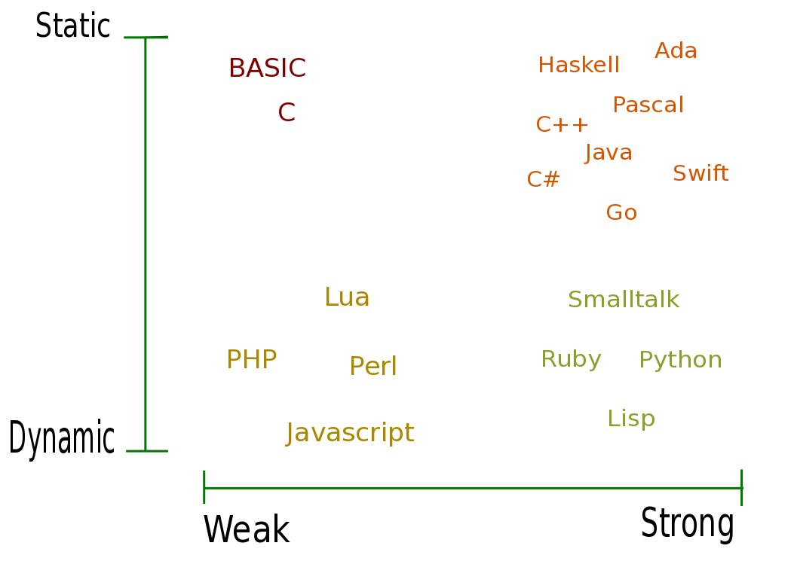
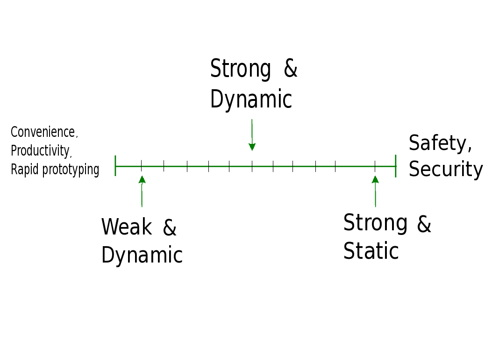

.. Type hinting hands-on slides file, created by
   hieroglyph-quickstart on Sat Nov 19 20:06:37 2016.

Optional static typing
======================

*by Ilya Etingof, Red Hat Product Security*

Agenda
======

* Variables, types and their interplay
* Why checking types?
* Type checkers
* Adoption of static typing

Variable
========

* Named storage
* Name to address stored data
* Name introduces scoping and inheritance

Data type
=========

* Type gives structure and meaning
* But what exactly is Type?

Ways to define type
===================

* All possible values
* All applicable operations

Names and types
===============

Can we:

* Use name with different type?
* Interpret typed data differently?

Static vs Dynamic
=================

Reflects the strength of name-to-type binding:

.. code-block:: python

    # `x` name points to integer object
    x = 1

    # now point `x` to a string object -- that's dynamic
    x = '1'

Strong vs Weak
==============

Willingness to automatically coerce types:

.. code-block:: python

    # fails on `+` operation -- sign of stronger typing
    x = '1' + 1

    # but this succeeds -- sign of weaker typing
    y = 1 + 1.0

Which is better?
================

.. nextslide::

Convenience + Safety?
=====================

* Stay dynamic and strong
* Check types when requested

Type checking process
=====================

Two tests:

1. What type is permitted for a variable?
2. Is used type compatible with the permitted one?

What type is permitted?
=======================

* Infer from assignment
* Rely on programmer's declaration

How to compare types?
=====================

Approaches:

* By inheritance relationship (AKA nominal)
* By interface (AKA structural)

Compare inheritance chain
=========================

Python types are arranged in a tree with `object` at its root:

.. code-block:: python

    >>> issubclass(bool, int)
    True
    >>> issubclass(float, int)
    False
    >>> issubclass(int, object)
    True

Compare interfaces
==================

Unrelated types may look similar enough:

.. code-block:: python

    >>> issubclass(UserDict, dict)
    False
    >>> hasattr(UserDict, '__getitem__') and hasattr(dict, '__getitem__')
    True
    >>> hasattr(UserDict, 'keys') and hasattr(dict, 'keys')
    True

Structural typing is hard to implement!

Is it worth the trouble?
========================

Dynamic typing is error-prone:

.. code-block:: python

    def gcd(a, b):
        while a:
            a, b = b % a, a
        return b

    >>> gcd(4, 6)
    2
    >>> gcd('a', 'b')
    TypeError: not all arguments converted during string formatting

Static typing in Python
=======================

* Long running research dating back to 2004
* Many implementations: PyContracts, typechecker, mypy etc.
* Highly controversial topic!

PyContracts
===========

* Runtime
* Ensures proper function args and return types
* Supports arithmetic constraints, predicates
* Can be disabled for production

Validates types by inheritance:

.. code-block:: python
   :emphasize-lines: 1

    @contract(a='int,>0', b='list[N],N>0', returns='list[N]')
    def my_function(a, b):
         # Requires b to be a nonempty list, and the return
         # value to have the same length.
         ...

Mypy
====

* Runs at linting time
* Validates types of function args and free variables
* Infers types from first assignment
* Validates only by inheritance (at present)

Common framework
================

Based on two Python features:

* Function annotations
* Type hints (AKA `typing.py`)

Annotations
===========

* Attaching arbitrary objects to variables
* Optional, no predefined semantics
* Supported in Py3 since 2006

.. nextslide::

* Can annotate function args, return, free-standing variables
* Comes with weird syntax

.. code-block:: python
   :emphasize-lines: 1

    def gcd(a: 'arg1', b: 'arg2') -> 'out':
        while a:
            a, b = b % a, a
        return b

    >>> gcd.__annotations__
    {'a': 'arg1', 'b': 'arg2', 'return': 'out'}

Type annotations
================

We can annotate with built-in types or user classes:

.. code-block:: python
   :emphasize-lines: 1

    def gcd(a: int, b: int) -> int:
        while a:
            a, b = b % a, a
        return b

Type hints classes
==================

* Compute types relationship
* Inheritance and (partial) interface-based validation
* For type checkers use only
* Do not impose runtime performance penalty

.. nextslide::

Type hints are similar to ABCs:

.. code-block:: python
   :emphasize-lines: 3

    from typing import Sequence, Mapping

    def select_values(d: Mapping, s: str) -> Sequence:
        return [v for k, v in d.items() if s == k]

    select_values({1: 'x'}, 'x')

.. nextslide::

Can express complex types:

.. code-block:: python
   :emphasize-lines: 3

    from typing import List, Dict

    def select_values(d: Dict[str, int], s: str) -> List[int]:
        return [v for k, v in d.items() if s == k]

    l: List[int]
    s: str

    l = select_values({'x': 1}, 'x')

.. nextslide::

Can get insanely detailed:

.. code-block:: python
   :emphasize-lines: 7

    from typing import Dict, Tuple, List

    ConnectionOptions = Dict[str, str]
    Address = Tuple[str, int]
    Server = Tuple[Address, ConnectionOptions]

    def broadcast_message(message: str, servers: List[Server]) -> None:
        ...

.. nextslide::

Type hints classes:

* `Sequence`: type supporting sequence protocol
* `Iterable`: type supporting iterator protocol
* `Callable`: function type
* `Generator`: generator type
* `Awaitable`: asyncio coroutine return
* Generic variables and classes
* ...and many more

Stub files
==========

* Stub files (.pyi) for annotations to keep code clean
* Works for C extensions and third-party libs
* Stubs for stdlib maintained in `typeshed` github repo

.. code-block:: python

    def select_values(d: Dict[str, int], s: str) -> List[int]:
        ...

Why static typing?
==================

* Improves linting accuracy
* Lets you omit some runtime checks
* Serves as documentation
* Powers IDEs automation

Helps static analyser
=====================

.. code-block:: python
   :emphasize-lines: 3

    from typing import Tuple

    def make_dict(*items: Tuple[str, int]):
        return dict(items)

    make_dict((1, 'x'))

Running `mypy` over this code yields:

.. code-block:: bash

    $ mypy example.py
    Argument 1 to "make_dict" has incompatible type
    "Tuple[int, str]"; expected "Tuple[str, int]"

Improves code readability
=========================

With legacy docstrings:

.. code-block:: python

    def ahoj(name='nobody'):
        """Greet a person

        :param name: string value
        :rtype: string value
        """
        return 'Ahoj {}!'.format(name)

with Type Hints (with `sphinx-autodoc-annotation`):

.. code-block:: python

    def ahoj(name: str = 'nobody') -> str:
        """Greet a person"""
        return 'Ahoj {}!'.format(name)

Makes IDEs better
=================

PyCharm 2016 supports type hinting in function
annotations and comments:

.. figure:: pycharm.png

Critique
========

* Undermines duck typing
* Does not catch all typing bugs
* Introduces ugly syntax
* Litters code with typs definitions
* Stubs maintenance is a pain

Should I use it?
================

* The larger your project
* ...the larger your team
* ...the heavier you refactor your code
* the more you may need it!

Can I use it?
=============

If you are at Python:

* 3.6+: just install `mypy-lang`
* 3.5+: like 3.6, but variable annotations go to comments
* 3.1..3.4: like 3.5 plus need to `pip install typing`
* 2.7: like 3.4 plus all annotations go to comments
* 2.6: Seriously...? ;-)

Where do I start?
=================

* Make `mypy` running over unannotated code
* Invoke `mypy` from git commit hook
* Gradually annotate your code starting from core
  parts
* ...try Google's `PyType` for generating `.pyi` stubs
* Disallow unannotated commits entirely

Questions?
==========

.. figure:: snake-clipart-image-4.png
   :scale: 70 %
   :align: center
