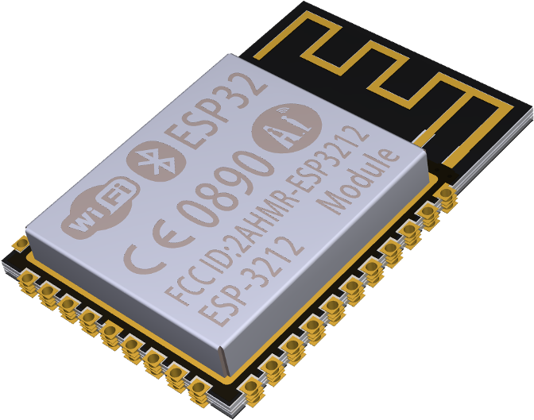
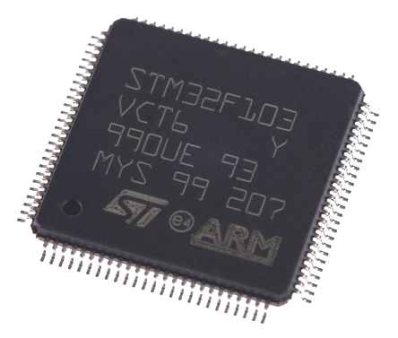
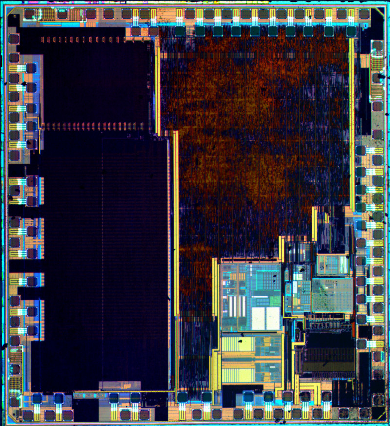
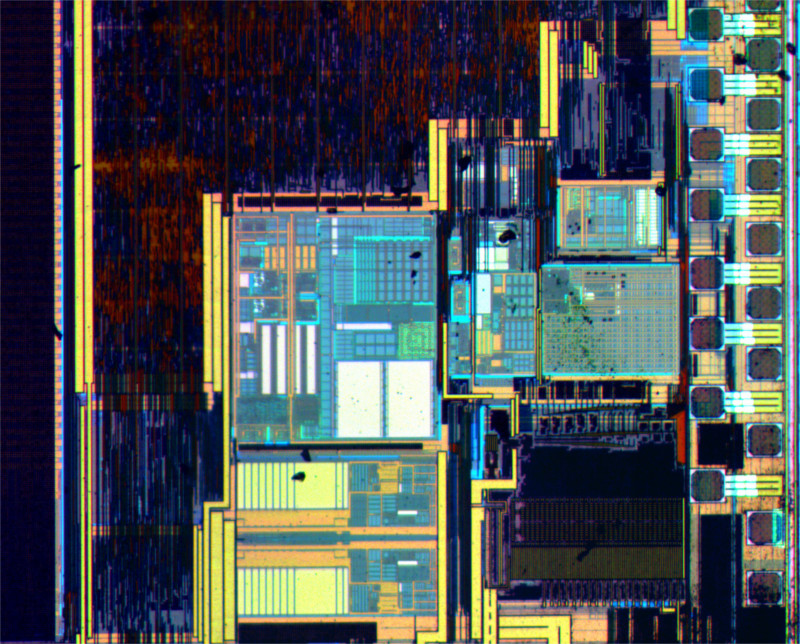
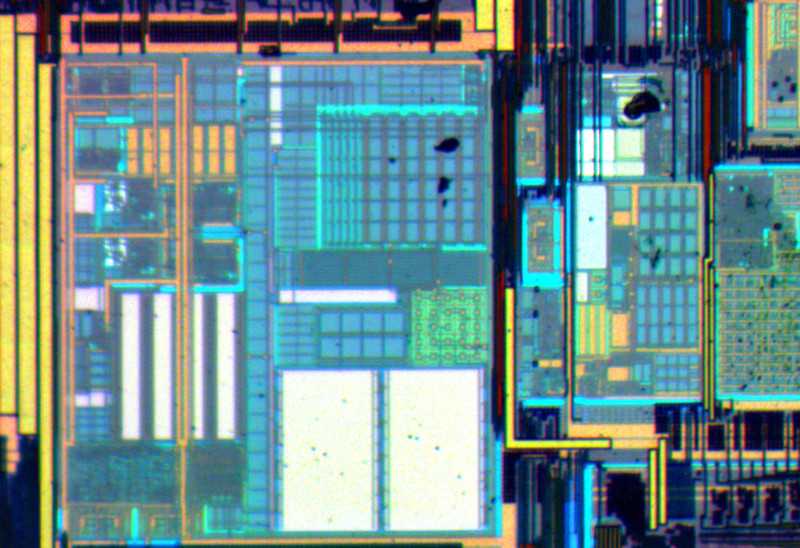
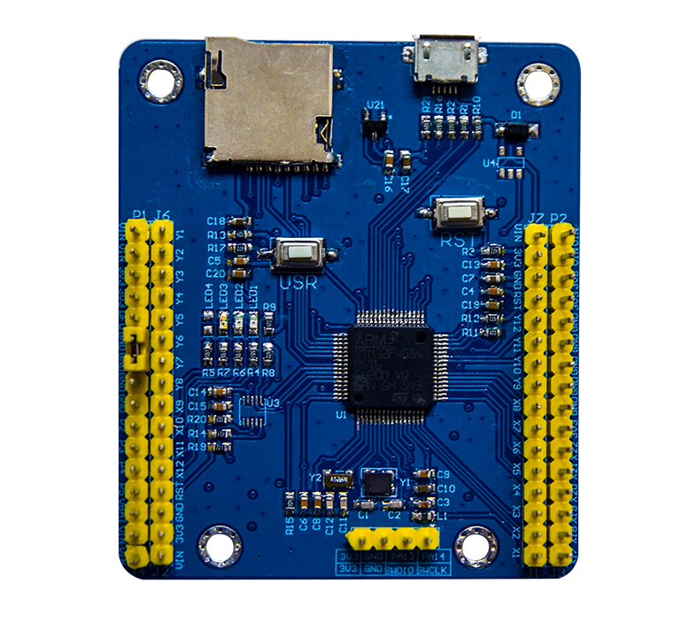
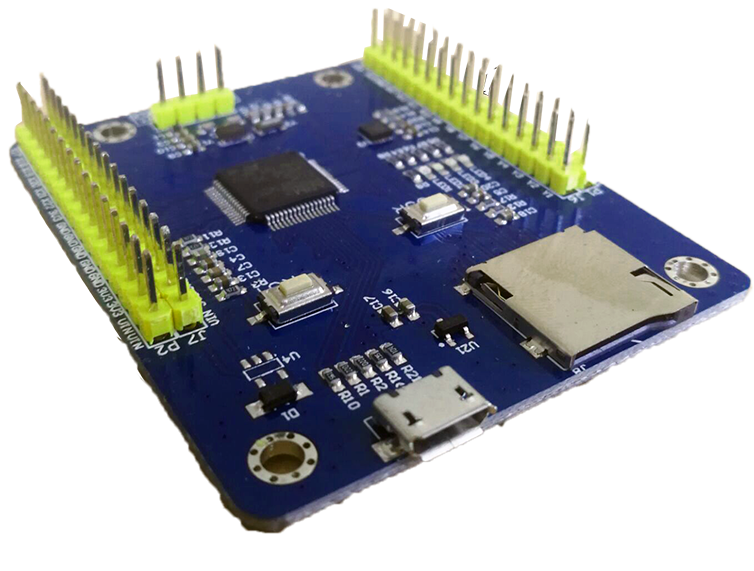
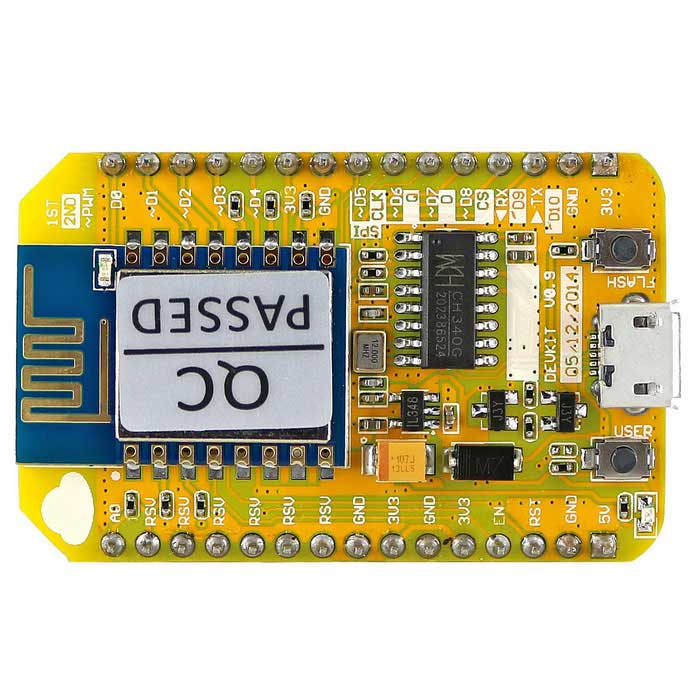

Python on the bare metal
========================

*by Ilya Etingof, Red Hat*

.. figure:: micropython-logo.png
   :scale: 50%
   :align: center

   Micro Python

Agenda
======

* Micro Python - Python on bare metal
* The boards
* Development workflow
* Live demo \\o/

The microcontrollers
====================

* System-on-Chip
* On-board RAM & Flash
* Hardware ports (I2O, GPIO etc.)
* Power efficient

The MCU
=======

   Espressif Systems ESP32

The SoC
=======

   STMicroelectronics STM32 SoC

Inside the SoC
==============

   STMicroelectronics STM32 SoC

Inside the SoC
==============

   STMicroelectronics STM32 SoC

Inside the SoC
==============

   STMicroelectronics STM32 SoC

Programming for MCUs
====================

* Code in C
* Cross-compile
* Upload the binary

The Micro Python way
====================

* Code in Python 3
* Upload Python script

What is MicroPython?
====================

* Complete new implementation of Python 3.4
* Efficient on resources (8K of RAM)
* Can runs on bare metal

Similarities with CPython?
==========================

* It's Python 3.4
* Mostly the same syntax and semantics
* Some of stdlib
* upip-installable packages
* REPL
* FOSS (though different licenses)

Differences from CPython?
=========================

* Slight variations in syntax and stdlib API
* Add-on modules to access BM
* Inline assembler
* Can run on the bare metal

The MicroPython composition
===========================

* Core: Compiler + runtime/VM

  * Compiler emits either bytecode or machine code (ASM inliners)

* Core runs on OS or BM
* Installable modules (starting with u)

The hardware
============

* PyBoard
* ESP8266
* ESP32
* Micro:Bit
* WiPy
* ...

(T)PyBoard v102
===============

* CPU: STMicroelectronics 32-bit ARM Cortex
* Flash: 1024KB
* RAM: 192KB
* IO: GPIO(30) SPI(2) CAN(2) I2C(2) USART(5) ADC(12) DAC(2) SWD(1)
* On-board: Timer, RTC, Accelerometer
* Price: 330CZK

(T)PyBoard v102
===============

   (T)PyBoard v102

(T)PyBoard v102
===============

   (T)PyBoard v102

How it works
============

* REPL prompt via serial console
* The pyboard tool
* Files on flash

  * boot.py
  * main.py

The stdlib
==========

.. code-block:: python

   >>> help('modules')
   http_client_ssl   sys               urando            http_server
   time              http_server_ssl   uasyncio/__init__ urequests
   uasyncio/core     urllib/urequest   apa102            json
   ubinascii         uselect           array             lwip
   ucollections      usocket           btree             machine
   uctypes           math              uerrno            ustruct
   dht               pyb               uhashlib          utime
   ds18x20           neopixel          uheapq            utimeq
   errno             network           uio               uzlib
   esp               ntptime           ujson             webrepl
   example_pub_but   onewire           umqtt/robust      webrepl_setup
   example_sub_led   os                umqtt/simple      websocket
   flashbdev         port_diag         uos               websocket_helper
   framebuf          select            upip
   gc                socket            upip_utarfile
   http_client       ssd1306           upysh
   Plus any modules on the filesystem

Hardware access
===============

.. code-block:: python

   >>> help(pyb)
     freq -- <function>
     reset -- <function>
     unique_id -- <function>
     idle -- <function>
     sleep -- <function>
     disable_irq -- <function>
     enable_irq -- <function>
     RTC -- <class 'RTC'>
     Timer -- <class 'Timer'>
     WDT -- <class 'WDT'>
     Pin -- <class 'Pin'>
     Signal -- <class 'Signal'>
     PWM -- <class 'PWM'>
     ADC -- <class 'ADC'>
     UART -- <class 'UART'>
     I2C -- <class 'I2C'>
     SPI -- <class 'HSPI'>

Demos
=====

* LEDs
* Switches
* Accelerometer
* GPIO
* Networking

LEDs
====

.. literalinclude:: scripts/ledheartbeat.py

Switches
========

.. literalinclude:: scripts/switchled.py

Accelerometer
=============

.. literalinclude:: scripts/accelleds.py

GPIO
====

.. literalinclude:: scripts/gpioin.py

Assembler
=========

.. literalinclude:: scripts/assembler.py

NodeMCU ESP8266
===============

* CPU: 32-bit RISC
* Flash: 512KB to 4096KB
* RAM: 96KB
* IO: GPIO(16) SPI(1) I2C(1) USART(1) ADC(1)
* On-board: Wi-Fi
* Price: 130CZK

NodeMCU ESP8266
===============

Originally Wi-Fi extension module for Arduino

   Espressif Systems ESP8266

Connect to WLAN
===============

.. code-block:: python

    import network

    wif = network.WLAN(network.STA_IF)
    wif.active(True)
    wif.connect('SSID', 'password')
    print(wif.isconnected())
    print(wif.ifconfig())

Web-REPL
========

Enable Web-sockets on the device:

.. code-block:: python

    import webrepl

    webrepl.start()

Setup web-sockets client on your PC:

.. code-block:: bash

    $ git clone git@github.com:micropython/webrepl.git
    $ cd webrepl
    $ python webrepl_cli.py -p 0000 myscript.py 192.168.1.139:
    op:put, host:192.168.1.139, port:8266, passwd:0000.
    myscript.py -> myscript.py
    $

Asyncio
=======

.. literalinclude:: scripts/aledflash.py

Online demo
===========

Micro Python in the browser:

* http://micropython.org/unicorn

Q&A
===

Thank you! ;-)

